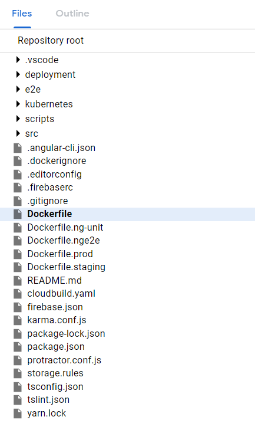
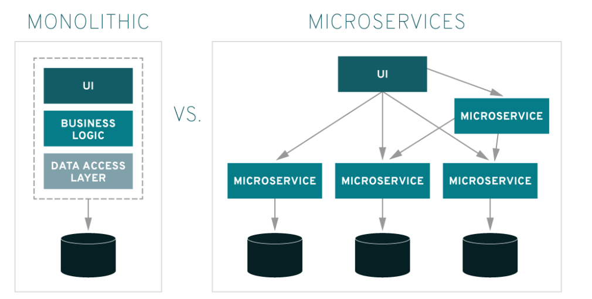

Before we talk about Docker and what is does, lets talk about some of the issues we face in development. 

  1. Its runs on my laptop/computer :) 
   
We often hear developers say, "But it runs perfectly on my computer" while it doesn't behave expectedly in production. This is one of the common issues developers face. Most of these issues are because the environments are not the same. 

  2. Scaling applications is expensive. Adding more Virtual Machines (VMs) can be expensive. Its easy / cheap to start development but it becomes expensive in large-scale applications.


  3. Lets say, our application requires integrating different services e.g Elastic Search. Should every developer install Elastic Search and all databases (e.g postgres) on their laptop? what if there are version issues? what about OS issues? Mac and a windows? what about production environment? which version will be used?


Here comes Docker 

### so what is Docker?

Docker is a **tool** designed to make it easier to create, deploy, and run applications by using **containers**.


Docker enables developers to easily pack, ship, and run any application as a lightweight, portable, self-sufficient container, which can run virtually anywhere.

### So what actually is a container?

Containers allow a developer to package up an application with all of the parts it needs, such as libraries and other dependencies, and ship it all out as one package.

Containers are encapsulated environments in which applications are run.

There are three main concepts regarding Docker

1. Docker Images

2. Containers

3. Dockerfile

Docker is a technology that allows you to incorporate and store your code and its dependencies into a neat little package - an **image**.

A docker image holds your source code and the dependencies it needs. Lets say you have a Node.js app, A docker image of your app will contain the code + the node_modules and everything that’s needed to run your Node.js app.

### Dockerfile

A Dockerfile is a text file that contains a bunch of instructions which informs Docker how the Docker image should get built.

Here is an Angular project with multiple Dockerfiles for each environment




sample Angular Dockerfile

```
# Build Angular and upload to Firebase Hosting

FROM johnpapa/angular-cli

WORKDIR /home/angularapp
COPY package.json ./
# RUN npm install && ng build --prod --aot --progress=false
RUN npm install npm@latest -g
RUN npm install -g firebase-tools
RUN npm install
COPY . /home/angularapp

RUN ng build --prod
RUN firebase deploy --token 1/h7xVYgTpyi4lt48D-8iasdasdasucj0aiFYz2Dk4
```

sample Node.js Dockerfile

```
FROM node:8.11.2-alpine
WORKDIR /app
COPY package.json ./
# Some packages for Node require these dependencies (e.g Bcrypt)
RUN apk add --no-cache --virtual .build-deps alpine-sdk python \
    && apk update && apk upgrade \
    && apk add pdftk  \
    && npm install --production --silent \
    && apk del .build-deps
RUN npm install
COPY . /app
EXPOSE 3000 
CMD [ "npm", "start" ]

```


### Why use Docker ? What are the benefits?  


Docker helps us set up local development environments that are exactly like a live production server.

Suppose you are working on multiple projects. They all have different environments. One project uses Postgres 9, One uses Postgres 10. This is not a headache with Docker. It will install what is required.

If you have 30 Docker containers that you want to run, you can run them all on a single virtual machine. To run 30 virtual machines, you’ve got to boot 30 operating systems with at least minimum resource requirements available before factoring the hypervisor for them to run on with the base OS.


Docker has been designed in a way that it can be incorporated into most DevOps applications, including Puppet, Chef, Vagrant, and Ansible, or it can be used on its own to manage development environments.

Agile and CI / CD practices are very easy to implement in a docker environment.

 Your development team is able to create complex requirements for a **microservice** within an easy-to-write Dockerfile.

The performance difference b/w Containers and VMs is 26:1. Those types of efficiency gains are on par with cloud providers like Amazon and on the virtual machines that they sell per hour. It’s a huge enabler for their businesses because you’re suddenly able to do a lot more for the same price.

### Docker Alternatives?

Although Docker is the most popular container technology, but there many other container solutions out there:
BSD Jails
LXD
RKT (pronounced as Rocket)

### Container Orchestration

Like any other element of your IT infrastructure, containers need to be monitored and controlled. Otherwise, you literally have no idea what's running on your servers.

That is where Orchestration comes in. There are 3 big players. 

Docker Swarm, Kubernetes (built by Google), and Mesosphere (used by Twitter). Today, these are all still around, but Kubernetes is by far the most dominant cloud-orchestration program.

### Kubernetes 

Kubernetes (K8s) is an open-source system for automating deployment, scaling, and management of containerized applications.

"Designed on the same principles that allows Google to run billions of containers a week, Kubernetes can scale without increasing your ops team."

### Containers as a Service

AWS Fargate. Just build apps and Amazon will manage the containers for you (scale automatically).

### Microservices

Microservices are an architectural approach to building applications. As an architectural framework, microservices are distributed and loosely coupled, so one team’s changes won’t break the entire app. The benefit to using microservices is that development teams are able to rapidly build new components of apps to meet changing business needs.

Microservices can communicate with each other, usually statelessly, so apps built in this way can be more fault tolerant. This also allows dev teams to choose their own tools, since microservices can communicate through language-agnostic application programming interfaces (APIs).



Microservices can be written in different languages depending on the use case and requirement. Modern application development essentially consists of composing an application from a variety of services.


### Why not Docker?

Run applications as fast as a bare-metal server. Docker containers have less overhead than virtual machines. But Docker does not have zero overhead. The only way to get true bare-metal speed from an application is to run it directly on a bare-metal server, without using containers or virtual machines.

Docker also creates new security challenges — such as the difficulty of monitoring so many moving pieces within a dynamic, large-scale Docker environment. Before moving workloads to Docker, you need to evaluate the Docker-specific security risks and make sure you can handle them.

All the data stored inside a container will be lost forever once the container shuts down. Managing stateful applications in a docker environment is hard.

You have to think of ways to save your data somewhere else first. To keep data safe in Docker, you need to employ an additional tool – Docker Data Volumes. Yet, this solution is still quite clumsy and needs to be improved.

Docker should be avoided for production databases unless you have strong expertise in managing stateful applications in Docker.

