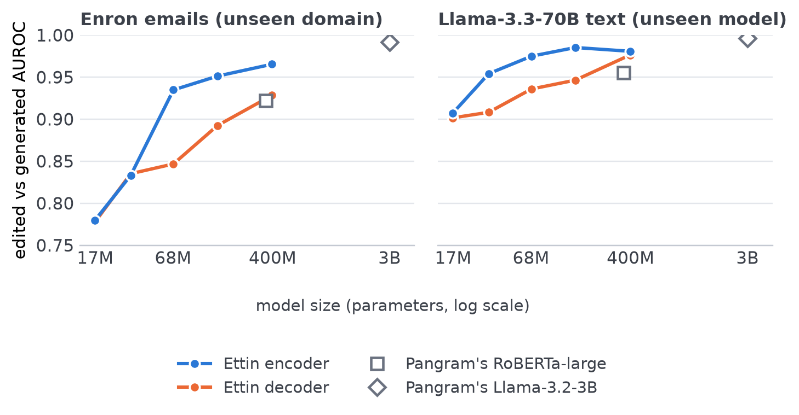

Pangram recently published [EditLens](https://arxiv.org/abs/2510.03154) (ICLR 2026). Instead of just saying whether a piece of text is human or AI, it gives an estimate of how much of it an AI has edited. They [open sourced two versions](https://www.pangram.com/blog/introducing-open-pangram), one built on RoBERTa-large (an encoder model) and one on Llama-3.2-3B (a decoder).

The interesting part of their results is on text model didnt saw during training. The Llama model barely drops (0.895 to 0.863 accuracy). The RoBERTa model falls off a cliff (0.881 to 0.695). It gives the reading that decoders generalize better.

Those two models differ in a lot more than encoder vs decoder. Llama model is about 8 times bigger, reads twice as much text at once [bigger context window] (1024 vs 512 tokens), was trained on much newer data, uses a different tokenizer and was fine-tuned in a different way.

## The setup

[Ettin](https://arxiv.org/abs/2507.11412) is a family of models where every encoder has a decoder equivalent. Same training data, same recipe, same tokenizer, same number of parameters. The only real difference is the architecture.

I fine-tuned encoder and decoder pairs at 17M, 32M, 68M, 150M and 400M parameters on the EditLens training set (available on hf), using the EditLens code and settings for everything. A run takes anywhere from a few minutes to half an hour on a single RTX 4090 GPU. I scored the same three test sets that Pangram used: text like the training data, Enron emails, and text written by Llama-3.3-70B.

## What I found

The chart shows how well each model separates AI-edited text from fully AI-generated text (AUROC, where 1.0 is perfect). That's the hard part of this task. Telling human from AI is basically solved by every model here.

On text like the training data, the encoder and decoder lines sit on top of each other at every size, so I left that panel out. The difference only shows up on unseen text. There the encoder is never behind by more than a rounding error, and from 68M upwards it's clearly ahead. The gap is widest around 68M to 150M and gets smaller by 400M.

A few things surprised me.

A 68M encoder does as well as a 400M decoder. Every AUROC I measured is within 0.006 of each other. The 150M encoder beats the 400M decoder outright, with less than half the parameters and less than half the training time.

Pangram's RoBERTa-large (the grey square) lands close to my decoder line, not my encoder line. On Enron my 400M encoder gets 0.819 macro F1 against RoBERTa's 0.673, and nearly all of that difference comes from recognising fully AI-generated emails (0.823 vs 0.515 F1). Whatever made RoBERTa collapse, it wasn't being an encoder. My best guess is its older pretraining. It isn't the 512 token limit either, since most Enron emails are well under that length.

Here's the Enron table in the same format as Pangram's. Their rows are their published numbers.

| Model | Macro F1 | Human F1 | AI F1 | AI-edited F1 |
| --- | ---: | ---: | ---: | ---: |
| Pangram Llama-3.2-3B | 0.868 | 0.855 | 0.936 | 0.812 |
| Ettin encoder 400M | 0.819 | 0.867 | 0.823 | 0.766 |
| Ettin encoder 150M | 0.746 | 0.843 | 0.703 | 0.691 |
| Ettin decoder 400M | 0.695 | 0.844 | 0.576 | 0.665 |
| Ettin encoder 68M | 0.692 | 0.844 | 0.575 | 0.658 |
| Pangram RoBERTa-large | 0.673 | 0.847 | 0.515 | 0.657 |
| Ettin decoder 150M | 0.639 | 0.832 | 0.455 | 0.631 |
| TF-IDF + logistic regression | 0.604 | 0.739 | 0.505 | 0.568 |

Pangram's 3B Llama is still the best model in the table. But it's 8 times bigger than anything I trained, so it doesn't say much about architecture on its own.

## caveats

These are one training run per model. Results on unseen data can move a lot between runs, so I want a couple more seeds before calling the 68M result solid.

The decoders might be at a disadvantage in how they classify. The encoder averages over every word and starts with part of a pretrained classification head. The decoder only looks at the last word and its head starts from scratch. That's the standard way to do it, and it's the same setup Pangram's Llama uses, but it could hurt small decoders more than big ones. Trying averaging for the decoders is next on my list.

## so

With everything else held equal, decoders don't generalize better at this task, at least up to 400M. If anything encoders do, especially at smaller sizes, and the gap closes as the models get bigger. The big difference in the EditLens results looks like it comes from comparing an older, smaller encoder with a newer, bigger decoder.

## What about JEV

Jev is a very interesting model and architecture. This is worth reviewing and will tak a look at it as an option in this encoder/decoder architecture world.