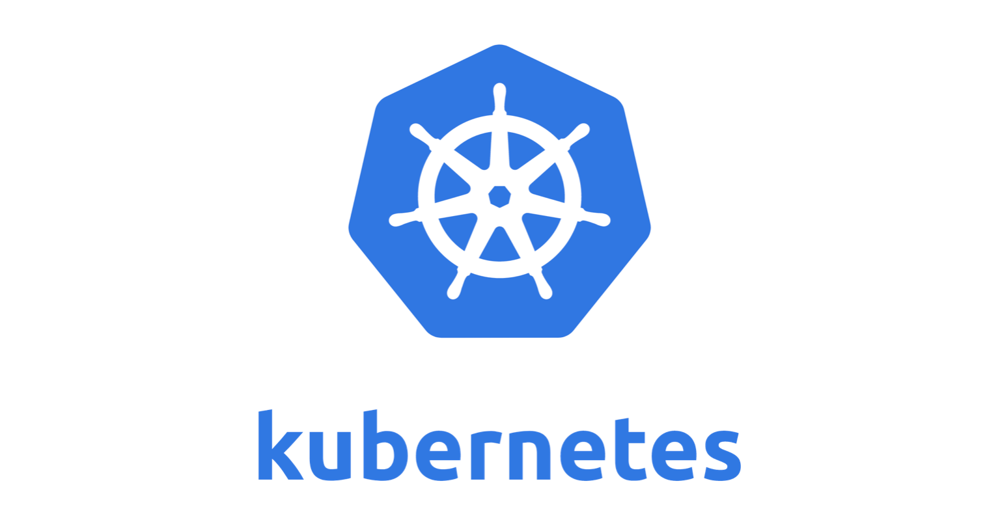

## Ways to expose your app in Kubernetes


Kubernetes is an open-source system for automating deployment, scaling, and management of containerized applications built by Google. Kubernetes has now become the leader in container orchestration.

There are different ways we can expose our Kubernetes Deployments.

### 1. Load Balancer

Kubernetes provides a simple HTTPS L7 Load Balancer. In order to expose a deployment, run this command in Kubectl. Here, myapp is our deployment which is available via ClusterIP but isn't exposed to the outside world.

```javascript{numberLines: true}
kubectl expose deployment myapp - type="LoadBalancer"
```

### 2. Ingress

Ingress can be considered as a fancier Load Balancer with more configurations. In Kubernetes Engine, Ingress is implemented using Cloud Load Balancing. When you create an Ingress in your cluster, Kubernetes Engine creates an HTTP(S) load balancer and configures it to route traffic to your application. We can set up several rules for our load balancer. Ingress can also help in exposing multiple services via a single host endpoint with different URLs.

In order to set up Ingress, we need to do 2 things.

1. Reserve a static IP on Google Cloud.

2. set up SSL of our domain. (needed if you want to expose to a custom domain e.g myapp.com instead of a reserved IP address).

Step 1:

Run the following command and make sure you have Google Cloud SDK (https://cloud.google.com/sdk/) installed and configured.

```javascript{numberLines: true}
gcloud compute addresses create kubernetes-ingress - region us-central1
```

This will reserve a static IP with the name kubernetes-ingress.

Step 2:

Download the private key for your custom domain.

Run the following command to generate the RSA Private key

```javascript{numberLines: true}
openssl rsa -in private.key -out private_rsa.key
```

if you get passphrase error, run this

```javascript{numberLines: true}
openssl rsa -in privateKey.pem -out newPrivateKey.pem
```

Now run:

```javascript{numberLines: true}
kubectl create secret tls ingress-ssl - key private_rsa.key - cert mycert.crt
```

This will create an SSL configuration named ingress-ssl. We will use this configuration for our Ingress.

Here's a yaml configuration file for Kubernetes Ingress. This yaml file can be deployed.

```javascript{numberLines: true}
apiVersion: extensions/v1beta1
kind: Ingress
metadata:
name: kubernetes-ingress
# kubernetes-ingress is the name of static ip we've reserved in #Google Cloud
annotations:
kubernetes.io/ingress.global-static-ip-name: "kubernetes-ingress"
spec:
tls:
- hosts:
- myapp.com
secretName: ingress-ssl
backend:
serviceName: myapp
servicePort: 80
```

### 3. Port-Forward

Port-forward basically exposes a service running in Kubernetes cluster and maps it to a local port on your computer. The below command is an example. It exposes my service prometheus from namespace 'monitoring' and it maps it to localhost:8082. This can be ideal for testing purposes and for services that you do not want to expose to the outside world but might need for testing for your own.

```javascript{numberLines: true}
kubectl port-forward svc/prometheus - namespace monitoring 8082:9090
```

Which one should you use?

Load Balancer is ideal if you are testing and only have a single service that you want to expose. Mostly this is not the case and thus this can become expensive.

Port-Forward is mostly for testing locally and not an option to expose for production.

Ingress is the most likely solution as it provides more customization and offers much more.

There are also other ways to expose your Kubernetes service. Have a look at Istio (a service mesh) or an API Gateway like (Express-gateway for Node.js).
