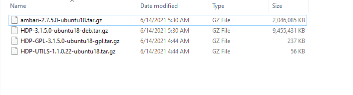
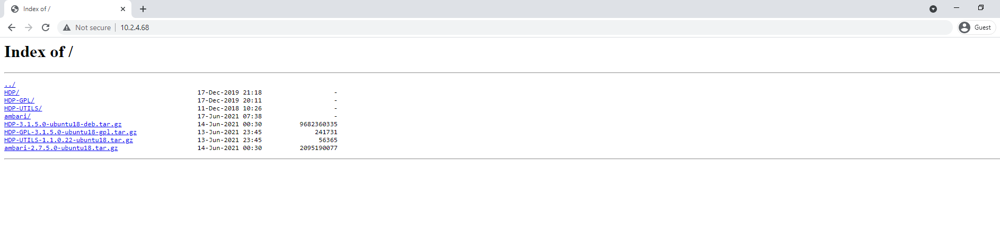

There are different way to install Hadoop ecosystem. One way is to install every component of Hadoop itself as they're all open-source and try to get them to work together. This is hard and also tiring. Other way is to use Hadoop Distributions like MapR, Cloudera Platform and Hortonworks Data Platform.

I have some bad news. Cloudera purchased Hortonworks Data Platform and stopped its development. Now even if you want to install previously open-sourced Hortonworks Data Platform, you need to sign up with Cloudera and purchase it. That really sucks I know. 

There is still something you can still if you're hell bent on installing Hadoop Ecosystem. What you do is pick the last stable Hortonworks Data Platform release before it got closed and you set that up. You get Ambari, plus can add as many nodes as you want. Pretty cool right. So this is what I'll be going to do.

First thing's first, you need the Hortonworks Data Platform resource files. They are like 10 GB in size. You need to download them and put them in one of your machines (I'm assuming since you're installing Hadoop, you have like 2,3 nodes/machines available). You can easily find the link from torrent but if you still can find it, hit me up. 

Here is what those resource files look like.



You will need these four files. 


Step 1: 

copy these files to one of your ubuntu 18 machines. 

install nginx

sudo apt install nginx

copy these 4 files files to any location e.g /home/ta/www

unzip these files using `tar -xvf filename.tar.gz`

do this for all 4 files

Step 2: 

change nginx configurations

nano /etc/nginx/sites-enabled/default


update the root directory and make sure to bable autoIndex on in nginx

once changes are done

`systemctl restart nginx`

check your IP and access it from the web



All good. 

Now lets first discuss how our architecture will happen.

Lets say you have 4 nodes/machines/VMs

In the first machine, I would install Ambari (ambari-server). This is the GUI tool which will help us install different Hadoop components from the UI and update configurations. This is the primary reason why we decided for all this headache because eventually it will make our life easier. 

In the next 3 nodes, I will install Ambari-agent. This will help communicate b/w these nodes.

Lets start on Node 01 by installing Ambari-server

`nano /etc/apt/sources.list.d/ambari.list`

```
deb http://10.2.4.68/ambari/ubuntu18/2.7.5.0-72/ Ambari main

```

`nano /etc/apt/sources.list.d/ambari-hdp.list`


```
deb http://10.2.4.68/HDP-GPL/ubuntu18/3.1.5.0-152/ HDP-GPL main
deb http://10.2.4.68/HDP-UTILS/ubuntu18/1.1.0.22/ HDP-UTILS main
deb http://10.2.4.68/HDP/ubuntu18/3.1.5.0-152/ HDP main

```

`sudo apt-key adv --keyserver keyserver.ubuntu.com --recv-keys B9733A7A07513CAD`

`sudo apt-get install ntp`

`update-rc.d ntp defaults`


We will need to do these steps for all 4 nodes because we need them to access Hadoop installations and they can be accessed from this file server we created. 

now, to install **ambari-server**

`apt-get install ambari-server`

We need to update msql connector as it creates issues for us

`wget https://dev.mysql.com/get/Downloads/Connector-J/mysql-connector-java-8.0.25.tar.gz`

move mysql-connector-java-8.0.25.jar to /var/lib/ambari-server/resources/ and rename to mysql-connector-java.jar


Disable Firewall:

```
sudo ufw disable
sudo iptables -X
sudo iptables -t nat -F
sudo iptables -t nat -X
sudo iptables -t mangle -F
sudo iptables -t mangle -X
sudo iptables -P INPUT ACCEPT
sudo iptables -P FORWARD ACCEPT
sudo iptables -P OUTPUT ACCEPT
```

update your hostname: 


`nano /etc/hostname`
`ambarimagent.com`

update yours hosts: 

since you will add 3 more ambari-agents

`nano /etc/hosts`

```
10.2.4.69   ambariserver.com
10.2.4.70   ambariagent1.com
10.2.4.71   ambariagent2.com
10.2.4.72   ambariagent3.com

```

Now lets set up SSH keys: 

```
ssh localhost
ssh-keygen -t rsa -P '' -f ~/.ssh/id_rsa
cat ~/.ssh/id_rsa.pub >> ~/.ssh/authorized_keys
chmod 0600 ~/.ssh/authorized_keys
```

We will need this as we'll need to pass these keys b/w machines to enable paswordless SSH.

Now lets setup ambari-server via

`ambari-server setup`


Once done, open up 10.2.4.69:8080 and ambari UI should load up. Login via admin/admin

To allow adding other nodes to ambari-server, you need to pass ID_RSA Keys from ambari server to other nodes

```
ssh-copy-id -i ~/.ssh/id_rsa.pub root@ambariagent1.com
```

now do this same for all agents.

Once done, you need to do the same from all the agent machines.

```
ssh-copy-id -i ~/.ssh/id_rsa.pub root@ambariserver.com
```

Lets setup *ambari-agent*

```apt-get install ambari-agent``` (make sure you followed the steps we did for ambari-server)

There is one more step we need to do for every ambari-agent

`sudo nano /etc/ambari-agent/conf/ambari-agent.ini`

change hostname to ambariserver.com

that's it. Ambari-server and Ambari-agent have been setup.

Now just go to Ambari UI, add each ambari-agent node one by one. 

you will need to write their hostnames and their id_rsa keys in the below boxes which u can copy/paste from `cat .ssh/id_rsa`

This was kinda simplified way of installing Hadoop Hortonworks Data Platform. Hadoop is a huge ecosystem, make sure you know what your use-cases are for using it. If you want big-data analytics, Hadoop Ecosystem might not be the best toolset anymore. If you do lots of ETL and processing in memory, yes Hadoop is great and will help you out. Moreover, best bits of Hadoop (Spark Ecosystem) are not dependant on Hadoop anymore which is great. Bottomline is, Hadoop is great but understand your use case. Experiment with this whether it will work for you or not. 

We had a use-case where we processed TBs of data (per day) and needed real-time statistics. Hadoop failed for this. Watch out this space and I will share how we handled that.