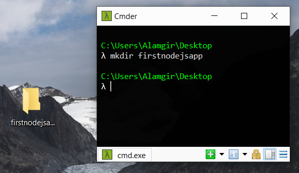
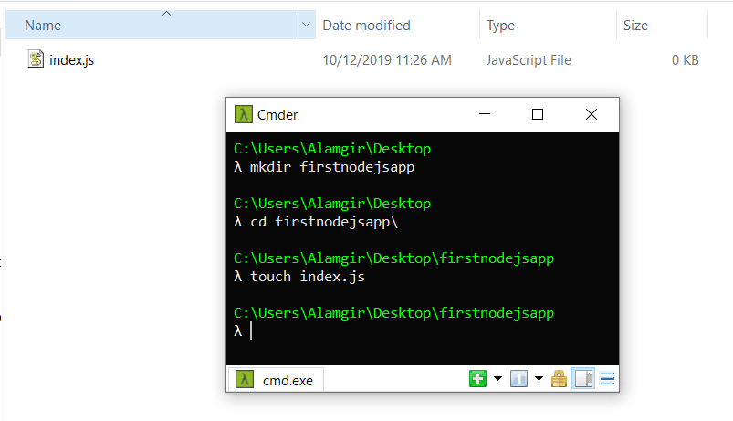
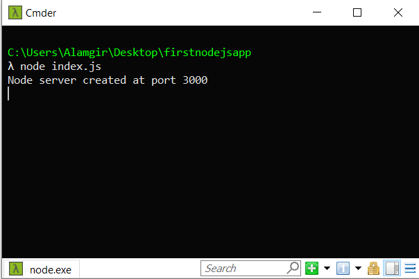
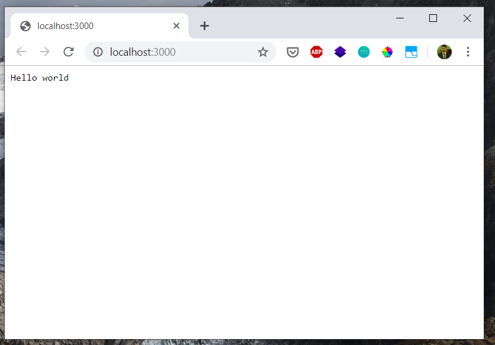
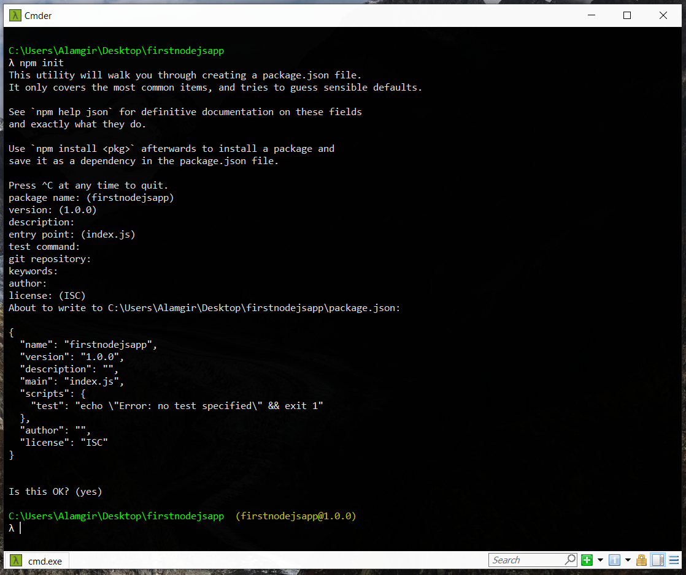
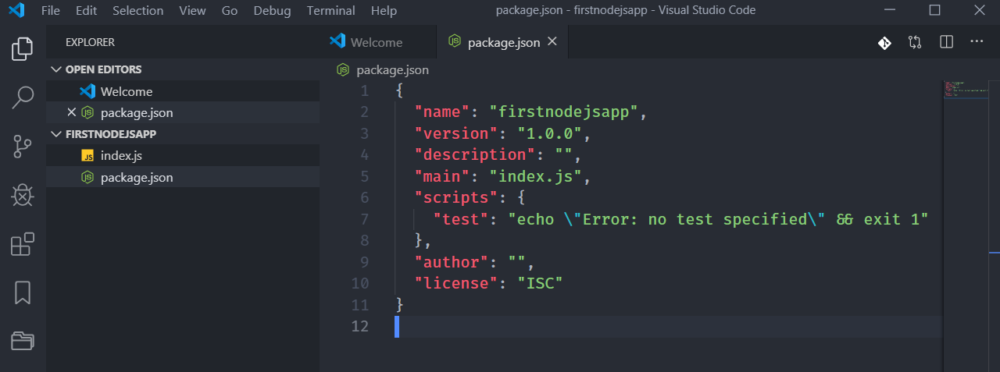
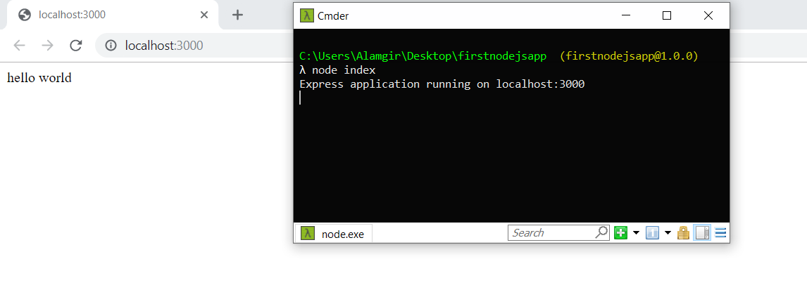
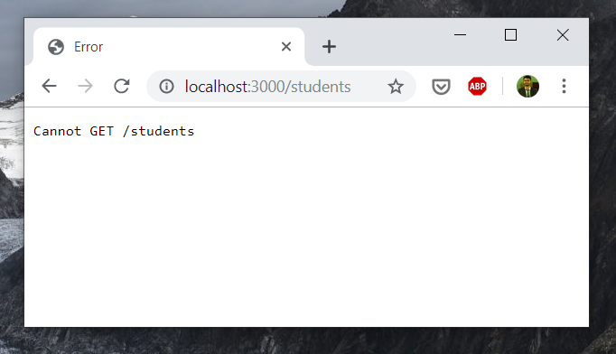
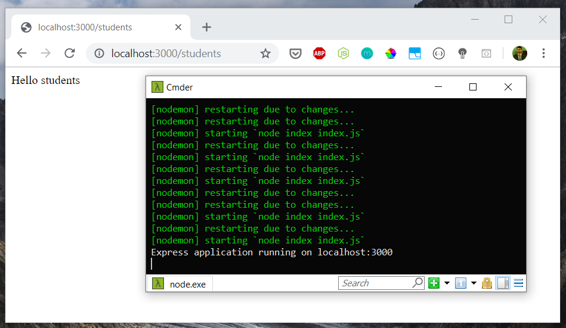
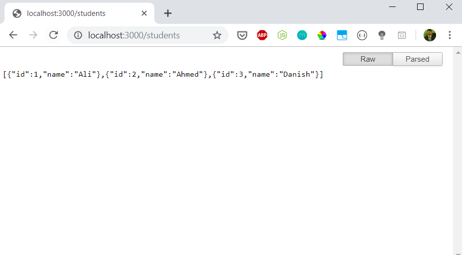

## What is Node.js ? 

Node.js is basically a run-time environment that helps us run JavaScript code on the server. That means just like PHP, Ruby, Python,
Golang etc, You can use JavaScript on the server. Node.js is ideal for building REST APIs.

## Why is Node.js famous?

* Front-end developers who are familiar with JavaScript don't have to learn a new language to write backend. 

* Node.js is fast and scalable.

* Very large ecosystem (npm biggest package manager in the world).

* Asynchronous or non-blocking nature.

* It is easy to get started.
  
However, remember it has its use cases. It is not ideal for CPU intensive tasks but very good for Asynchronous / Real-time tasks. We'll go over them soon. 

So lets get started. 

## Writing my first program in Node.js

First, let's setup our project. we need to make a new folder. 

```
mkdir firstnodejsapp
````

will create a new folder with that name



Cool. Now lets go into that directory

```
cd firstnodejsapp
````

Great. Now lets create a file. We need to create any js file. lets create an index.js file. 

```
touch index.js
````



That wasn't so hard. its quite easy doing it in the command line as well. Feels cool right? 

now lets open it in VS Code 

```
code .
````

Excellent. Our `index.js` file is empty. Lets add some Node.js / JavaScript code. 


We will create a very simple http server in node.js and see how easy it is and how few lines of code it is. 

```
const http = require('http');

const server = http.createServer();

server.on('request',(request,response)=>{
   response.writeHead(200,{'Content-Type':'text/plain'});
   response.write('Hello world');
   response.end();
});

server.listen(3000,()=>{
  console.log('Node server created at port 3000');
});

```

Let go over what's happening. 

`require('http')` will help us import the already built-in http module in node.js. 

After we require, we simply create the server using `const server = http.createServer();`

This is a callback function. it basically listens to request and will respond with 'Hello World' and that's it.

```
server.on('request',(request,response)=>{
   response.writeHead(200,{'Content-Type':'text/plain'});
   response.write('Hello world');
   response.end();
});
```

Here we will telling it to listen to port 3000. This means our Node.js app / server will be running on localhost:3000 (you can change it to any you want). Remember, Angular app locally runs on localhost:4200, Ionic App runs on localhost:8100 etc.

```
server.listen(3000,()=>{
  console.log('Node server created at port 3000');
});

```

Ok, so now we have some idea of what that code means. Lets actually run it. How will we do it? Simple. 

(make sure you have node.js installed)

```
node index.js    
```

<br/>



That message means our node.js app is running. (in case you want to stop ```control + c```)

Awesome. Lets head over to [localhost:3000](localhost:3000) and see if it's real.




It is real :D

Okay, so we learned how easy it was to create a simplest server in Node.js. 

But If we started building programming from the scratch like this, it would take a lot of time. That's where *Frameworks* come in. 

Frameworks provide us alot of already built functions and modules which help us to easily build reliable applications using less code.

For Node.js, there are plenty of Backend Frameworks out there. Here's a few
 [Express.js](https://expressjs.com), [Nest.js](https://nestjs.com), 
 [Loopback.js](https://loopback.io), 
 [Hapi.js](https://hapi.dev), 
 [Koa.js](https://Koajs.com), 
 [Sails.js](https://sailsjs.com), 
 [Meteor.js](https://meteor.com), 
 [Fastify.js](https://fastify.io), and many more.

 Yes I know, so many. But it's okay. We'll only focus on one Framework. [Express.js](https://expressjs.com). 

## What is Express.js ?

Express.js is a minimalistic framework written for Node.js. It helps us to build node.js applications especially apis very easily. 

If you have heard of MERN or MEAN Stack, then you have also heard of Express. 

M MongoDB  
E Express.js  
A Angular/AngularJS  
N Node.js  


M MongoDB  
E Express.js  
R React.js   
N Nodejs  

There is also a MEVN Stack (V is for Vue.js).

Okay, so lets get back. 

What we need to do now is to create a very simple *express.js* application. 

Before installing Express.js, we need set up our *package.json*. How do we do that?

```
npm init
```

This will initialize your application with a package.json. Just keep pressing enter and you're done. 




> btw if you want to open the folder from the terminal, 

```
explorer .
```

Okay, so lets take a look at the package.json file. 



It's a very basic and very simple package.json file. So we need to install express framework. 


To install Express.js

```
npm install express
```

Once it gets installed, you will see it added in package.json dependencies. There will also be a node_modules folder.

Okay, so we're set. We will replace the code in the index.js and create the same server with even less lines of code using Express.js Framework.

```
const express = require('express');
const app = express();

app.get('/', (req, res) => { 
  res.send('hello world');
});

app.listen(3000, () => {
  console.log('Express application running on localhost:3000');
});
```

we require *express* package/module. We listen to port 3000 again. And any request on '/' will be responded with 'Hello World'. Lets see this in action. 

Lets run the code.


```
node indexjs
```

Success :D We have an expressjs app running



Lets go to a different URL.



Oops. It says no such URL exists. and its right. We only set up '/' route. 

If we change '/' to '*', This will show hello world page.

```
app.get('*', (req, res) => { 
  res.send('hello world');
});

```

hint: Whenever you change code, you have to restart the server. Meaning you have to 

``` ctrl + c``` and then ```node index``` again. This becomes tiring. However, there is a solution, there's a global npm module for this called *nodemon*. Lets install nodemon globally.

```
npm install -g nodemon 

```

Cool. Now we want to display a separate page for students.

Lets change it with this


```
app.get('/', (req, res) => { 
  res.send('hello world');
});
app.get('/students', (req, res) => { 
  res.send('Hello students');
});

```

and now we'll run it using nodemon 

```
nodemon index
```
now whenever you change content of file, it will automatically reload.



Great. But actually we want to use it as a REST API. That means we want to send / receive JSON. 

What we want here is to send us the list of students as JSON instead of displaying 'hello students' because frankly thats pointless and useless :D 

Ok, so for now, we'll use a dummy Array of students

Let replace that '/students' route with this

```
app.get('/students', (req, res) => { 

  const listOfStudents = [
    {id: 1,name: 'Ali'},
    {id: 2,name: 'Ahmed'},
    {id: 3,name: 'Danish'},
  ]

  res.send(listOfStudents);
});

```

Now when I open [localhost:3000/students](http://localhost:3000/students), I see this



If you install a Chrome extension ([JSON Formatter](https://chrome.google.com/webstore/detail/json-formatter/bcjindcccaagfpapjjmafapmmgkkhgoa?hl=en)), you will see JSON in a formatted way which looks nice.


So what we learned so far?

We learned to create a simple GET request in Node.js which returns list of students. But we used static data. How does it work in real app?

its some thing like 
```
app.get('/students', (req, res) => { 

<!-- listOfStudents = get students from mysql/mongodb/whatever database  -->

  res.send(listOfStudents);
});
```


we will look this in detail in **Part 2** of this tutorial.

Lets wrap this up and make it handle all scenarios

```
const express = require('express');
const app = express();

app.get('/', (req, res) => { 
  res.send('Welcome to my Node.js app');
});
app.get('/students', (req, res) => { 

  const listOfStudents = [
    {id: 1,name: 'Ali'},
    {id: 2,name: 'Ahmed'},
    {id: 3,name: 'Danish'},
  ]

  res.send(listOfStudents);
});
app.get('*', (req, res) => { 


  res.send('Page Doesnot exists');
});

app.listen(3000, () => {
  console.log('Express application running on localhost:3000');
});

```

We added a wildcard (*) route which will display whenever any url other than '/' or '/studentslist/' is hit. 


This was a very basic intro to Node.js and Mongodb. In the part 2, we will set up a simple Node.js but with login functionalities (Login / Signup) and which means we will cover MongoDB as well. 

If you have any questions, you know where to find me :)