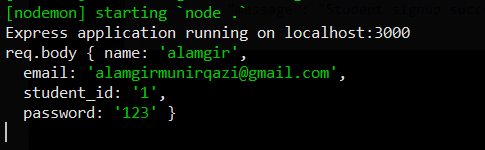

This is the part 2 of post [Intro to Nodejs - part 1](https://alamgirqazi.github.io/tech-blog/intro-to-nodejs-part-1/).

In this, we will continue from the express application we created and build a very simple Auth system.

What we need is a method to Login, a method to Signup and a method which returns us a list of students. We should only get the list of students if the user is authenticated / logged in.

So lets go.

Before we start, we need to know two things. GET and POST methods. GET and POST methods are used to transfer data from client to server in HTTP. The client can be a web app or a mobile app.

GET method is mainly for getting some data from the server. POST method is mainly for sending data to the server.

Before login, we need to add students. To add students, we need to send data to server (student name, student email, password etc). that means we will create a POST request.

Here is what the post request handler would look like.

```
app.post('/signup',  (req, res) => {
const body = req.body;

console.log('req.body', body)

const email = body.email;

// we need to check if email exists already or not

// if email exists, throw error
// otherwise
// insert into database

// Once saved to database, we will send response back to user with message ' User signup successfull'


  });


```

We will write actual code after we set up MongoDB but first we're trying to understand how it works. Lets say, our Signup feature has now been added, lets add a Login feature. Again in Login, data will be sent to server so again it will be a POST request.

```
  app.post('/login',  (req, res) => {
    console.log('req.body', body)

    const email = req.body.email;
    const password = req.body.password;

// 1. find if a user exists with email
// 2. if exists, check if password matches
// 3. if password matches, Success. (in case of success, we should create and send a token(jwt token))
// 4. otherwise, send error

  });
```

So, now we know we just need to create these methods, so lets head over to **MongoDB**

MongoDB is a nosql database. It is very different from sql databases such as mysql, postgresql, SQL Server etc.

But still, mongodb has some similarities with sql databases.

MongoDB has collections instead of sql tables.


I have written more about nosql databases [here](https://slides.com/alamgirqazi/nosql#/)

Okay, so now we need to set up MongoDB.

Download MongoDB Community Edition from [here](https://www.mongodb.com/download-center/community) and a tool to visualize your mongodb database, **Robo 3T** from [here](https://robomongo.org/download). Choose Robo 3T (formerly Robomongo) on the right.

Okay, all set. now we need to add mongodb to our existing express.js app.

MongoDB has an excellent ODM (Object Document Mapper) written for it called [**Mongoose**](https://mongoosejs.com/) which helps us alot with queries etc. We will use that. Think of Mongoose like an ORM for a sql database.

Lets install mongoose

```
npm install mongoose
```

MongoDB runs at port 27017 locally by default. So our database url will be localhost:27017/myfirstmongodb or whatever.

```
mongoose.connect('mongodb://localhost:27017/myfirstmongodb', {useNewUrlParser: true});
```

just this code added to the top and our database / mongoDB has been connected. It really is that simple.

Okay, lets talk a little bit about our students.

We can think of students as our Models (like th M in MVC). a student will have email, student_id, password, name at the very least. We represent this in a model. lets create that model using mongoose.

```
const Student = mongoose.model('Student', {
  name: String,
  student_id: Number,
  email: String,
  password: String,
  date_added: Date
 });

```

we also need to add one more module.

```
npm install body-parser
```

after this, add these line

```
const bodyParser = require('body-parser');
const app = express();
mongoose.connect('mongodb://localhost:27017/myfirstmongodb', {useNewUrlParser: true,useUnifiedTopology:true});

app.use(bodyParser.json());
app.use(bodyParser.urlencoded({
  extended: true
}));

```

Now, we have set up the model and setup bodyParser middleware. Lets write an actual **Signup** POST method.

```
 app.post('/signup', async (req, res) => {
const body = req.body;
console.log('req.body', body);
res.send({
  message: 'Success'
});

  });


```

We can use browser for GET requests but for POST requests we would have to use a client (mobile app or web app). There is an alternative. Using [Postman](https://www.getpostman.com/). Install it.

Okay, now lets run our Node.js app

```
nodemon index

```

Lets test route [localhost:3000/signup](http://localhost:3000/signup)


This is predictable because we wrote only POST method and not GET method. So how do we test POST method? using **Postman**.


Once we click on SEND, we get a response.


But something else also happened. Remember we added a console.log('req.body', body) before sending the response.

Here


What happened here is our Node.js server was hit with a request for signup and the data we got was {
name: 'Alamgir'
}.

This means our flows are ready. now if we add other values then they will be added themselves.

Once we get the full data, we can add that to the database after checking if it doesnot exist already.

So, let update the code to save it to MongoDB.

```
app.post('/signup', async (req, res) => {
const body = req.body;
console.log('req.body', body)
  try{
const student = new Student(body);

const result = await student.save();
res.send({
  message: 'Student signup successful'
});

  }
  catch(ex){
    console.log('ex',ex);
    res.send({message: 'Error'}).status(401);
  }

```

Now lets try again from postman


press Save



We see the data in cmder.

But is the data actually saved in Database/MongoDB? lets take a look.

Open Robo 3T.

connect to localhost


double click


Congratulations! Your student has been saved to MongoDB. that wasn't so hard right.

So what have we done? We have inserted a student into mongoDB using a post request.

Now, I wanna retrieve all students inside my database. For now, I have inserted 2 more using Postman.

Okay, so to retrieve, we get to get data from the server (Node.js) so in order to do that, we need to write a _GET_ request.

```
app.get('/students', async (req, res) => {

  const allStudents = await Student.find();
  console.log('allStudents', allStudents);

  res.send(allStudents);
});

```

This will return all the students in the database.


that is excellent.

So now that we have our students in the database, lets write a login method for them. What it would do is check by email if the user exists, if it exists, then it will check for password.

For login, we have to send email and password to the server from (mobile/web/client) so again, it will be a POST request.

here's how the login method would look like for now

```
 app.post('/login',  async (req, res) => {
    const body = req.body;
    console.log('req.body', body);

    const email = body.email;

    // lets check if email exists

    const result = await Student.findOne({"email":  email});
    console.log('result', result);

    // 2. if exists, check if password matches

res.send({
 result: result
});

  });

```

if the email doesnot exists, the result will be **null** otherwise we will get the object.

lets see

alamgir@gmail.com doesnot exists so


Okay, so lets try with an email that exists.


When the email exists, we will get an object in result instead of null.

Okay, so lets write an error in case the email doesnot exists.

```
   app.post('/login',  async (req, res) => {
    const body = req.body;
    console.log('req.body', body);

    const email = body.email;

    // lets check if email exists

    const result = await Student.findOne({"email":  email});
    if(!result) // this means result is null
    {
      res.status(401).send({
        Error: 'This user doesnot exists. Please signup first'
       });
    }

    console.log('result', result);

    // 2. if exists, check if password matches


  });
```


Now we're sending back proper error from server.

Okay, lets get back to login. If our email matches, we need to match the password.

In the variable **result**, we already have the password so we just match it with **body.password**

```

 app.post('/login',  async (req, res) => {
    const body = req.body;
    console.log('req.body', body);

    const email = body.email;

    // lets check if email exists

    const result = await Student.findOne({"email":  email});
    if(!result) // this means result is null
    {
      res.status(401).send({
        Error: 'This user doesnot exists. Please signup first'
       });
    }
    else{
      // email did exist
      // so lets match password

      if(body.password === result.password){

        // great, allow this user access

        console.log('match');

        res.send({message: 'Successfully Logged in'});
      }

        else{

          console.log('password doesnot match');

          res.status(401).send({message: 'Wrong email or Password'});
        }


    }

  });

```

Lets see it in action


Using the wrong credentials, we get error response (code : 401)


Using the right credentials, we get success response (code : 200)

So we set up a very simplistic auth system using node.js and express.js framework.

Here is the link to code. [github/simplest-nodejs-auth](https://github.com/alamgirqazi/simplest-nodejs-auth)

To run it locally,

```
$ git clone https://github.com/alamgirqazi/simplest-nodejs-auth

$ cd simplest-nodejs-auth

$ npm i

$ npm start

```

In this part, we learned how to connect with MongoDB database. How to create GET and POST requests in Express.js. Very few lines and alot of functionality.

Btw, there are many things that we do not use in production projects. For e.g we never save password in plain text. we use an ecrypted hash as password. We also have a single index.js file in the project we created which again is not ideal.

We will cover the best practices in part 3 of the tutorial.
