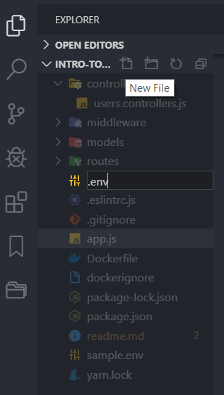

This is the part 4 of post [Intro to Nodejs - part 3](https://alamgirqazi.github.io/tech-blog/intro-to-nodejs-part-3/).

In this post, we will

1. fix two issues we found in last post. Writing all the code in one .js file and the other was writing secret keys inside our code.

2. create a complete new API for books.

Lets first tackle the first part. Creating a folder structure. Some Web Frameworks like Laravel (PHP), Django (Python), Nest.js (Node.js) create a proper folder structure when you start a project. However, Express.js gives you minimal. It doesnot forces you to follow anything. It gives you full control. This is why we need some boilerplate for Express.js which can help us maintain our project.

I have extracted and created an Express.js boilerplate and uploaded it on Github. It contains most best practices of how backend Express.js projects should be created. We will `clone` that project, see the complete folder structure one by one and go through it.

Here is the link to that repo [https://github.com/alamgirqazi/nodejs-express-mongoose-starter](https://github.com/alamgirqazi/nodejs-express-mongoose-starter)

First up, open up `cmd`,

```

git clone https://github.com/alamgirqazi/nodejs-express-mongoose-starter.git

cd nodejs-express-mongoose-starter

```


we can see a folder being created.

The first thing I often do is change folder name. You can pick any name. After that, I will go inside that folder -> view hidden files -> delete .git folder. because I don't want my old comment history. I want a brand new git history. Next, I open up package.json and change the name of project.

Since we deleted .git folder, lets do

```

git init

git add .

git commit -m "set up repo"

```

Okay, so lets take a look at the folder structure


### Controllers

They will contain our actual business logic.

### Middlewares

Middlewares are functions that are executed whenever a request is received by Express.js server. All requests have to go through middlewares first before actually hitting the controllers. This is where we will check if the user is authorized or not. (we will check it using JWT Token).

### Models

They are kind of an actual schema for your backend. They are optional but using them helps alot in managing node.js applications especially those that use MongoDB.

### Routes

This is where we define all the routing files. These are the routes that are in the end exposed.

### App.js

We try to keep this file as small as possible. This is where our Node.js application starts.

lets go through some of the things in `app.js` that wasn't in previous tutorial

```
require('dotenv').config();
```

if you take a look at package.json, there will be a package in dependencies called `dotenv`. It helps us manage environment variables and prevent writing secret values inside our code.

take a look at this code in app.js

```
// connection to mongoose
const mongoCon = process.env.mongoCon;

mongoose.connect(mongoCon,{ useNewUrlParser: true,useCreateIndex: true, useUnifiedTopology: true });

```

process.env.mongoCon holds the URL for our database. we're not directly writing it in our code.

How do we set mongoCon up? create a `.env` file in your project. your app won't run without it.



There will be a sample.env file in our project. copy the contents from there to .env file.

Now to run the project, first

```

npm i

or

yarn install


```

then

```
npm run dev
```

Great. Our app should be running now.

The login/register methods in this should work and some other methods have been added as well. They are in `users.controllers.js`

Lets take a look at line 49 of app.js

```
app.use("/users",UsersRoutes);

```

This means all user related routes will start from `localhost:3000/users`. In case we want to add more, we can easily add multiple routes.

Lets first signup

go to postman and post register [localhost:3000/users/register](localhost:3000/users/register)

try it again and it will throw this error


It says that a user with email bilal@gmail.com has already been registered.

Lets go to `users.controllers.js` and update register method

```

catch (ex) {
    console.log('ex', ex);
    if(ex.code===11000){
      res
      .send({
        message: 'This email has been registered already',
      })
      .status(500);
    }
    else {
    res
      .send({
        message: 'Error',
        detail: ex
      })
      .status(500);
  }
  }

```

Here I check if the error code is 11000, it means its duplicate error so I send a proper error which a user will understand.

You can test the login call as well [localhost:3000/users/login](localhost:3000/users/login)

Okay, so what we need is to create an API for Books. We want to be able to perform CRUD (Create, Read, Update, Delete) on Books.

Lets start.

First step. Create a model for Books. lets go copy and paste `users.model.js` file and name it `books.model.js`

This is what my books.model.js looks like

```

const mongoose = require('mongoose');
const mongoosePaginate = require('mongoose-paginate');
const Schema = mongoose.Schema;

const Book = new Schema({
     name: {
        type: String
    },
     ibn: {
        type: String,
        unique: true,
        sparse:true
    },
     author: {
        type: String
    },
    image_url: {
        type: String
    },
    is_deleted: {
        type: Boolean,
        default: false
    }
});

Book.plugin(mongoosePaginate);

module.exports = mongoose.model("Book", Book);

```

We now need a controller file. lets copy paste `users.controllers.js` file

This is what our books.controllers.js file looks like

```
const booksController = {};
const Books = require('../models/books.model');

booksController.getAll = async (req, res) => {
  let books;
  try {
    let merged = {};
    const start = 0;
    const length = 100;
    books = await Books.paginate(
      merged,
      {
        offset: parseInt(start),
        limit: parseInt(length)
      }
    );
    res.status(200).send({
      code: 200,
      message: 'Successful',
      data: books
    });
  } catch (error) {
    console.log('error', error);
    return res.status(500).send(error);
  }
};

booksController.addBook = async (req, res) => {
  try {

    const body = req.body;

    const book = new Books(body);

  const result = await book.save();

    res.status(200).send({
      code: 200,
      message: 'Book Added Successfully',
    });
  } catch (error) {
    console.log('error', error);
    return res.status(500).send(error);
  }
};
module.exports = booksController;


```

Now we need a router file as well.

Here's what our books.routes.js file looks like

```

const express = require("express");
const router = express.Router();

const bookController = require('../controllers/books.controllers');

router.get("/",bookController.getAll);
router.post("/add",bookController.addBook);
// router.get("/:_id",bookController.getSingleBook);
// router.put("/:_id", bookController.updateBook);
// router.delete("/:_id", bookController.deleteBook);


module.exports = router;

```

Right now, we focus only on Adding books and retrieving books.

We have all files ready, we just need to update our `App.js`

we first add routes for Books

```
// Requiring Routes

const UsersRoutes = require('./routes/users.routes');
const BooksRoutes = require('./routes/books.routes');

```

and we configure them with Express.js framework

```

// Routes which should handle requests
app.use("/users",UsersRoutes);
app.use("/books",BooksRoutes);

```

Okay, lets go to Postman and see if our new API is working


It works. Since we haven't added any book, docs is empty.

Lets add a books then


Lets add a few more and test [localhost:3000/books](localhost:3000/books) again

I added 3 books and now I can see them


I can even test this in the browser


Awesome.

We covered a lot of things in this. Before we dwelve deep into Node.js, we need to connect it to a web app or a mobile app because frankly we're tired of Postman. In next tutorial, we will use this api with an Angular web app and an Ionic mobile app.

Here is [Link to code of part 4](https://github.com/alamgirqazi/intro-to-nodejs-part4)
