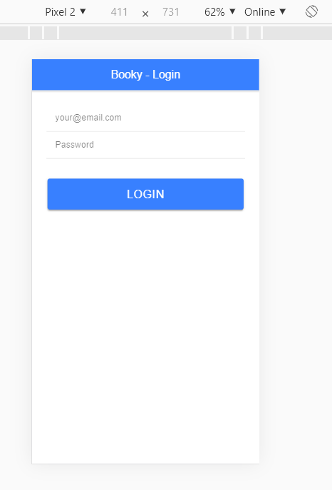
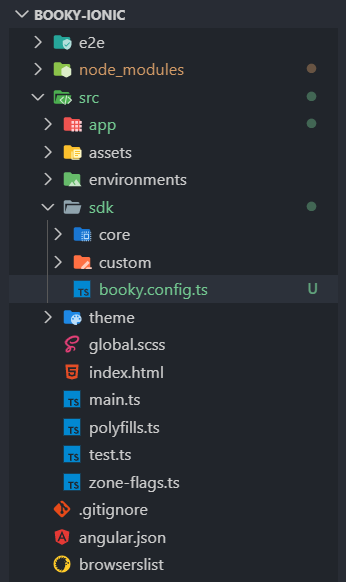
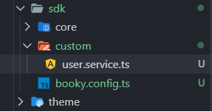
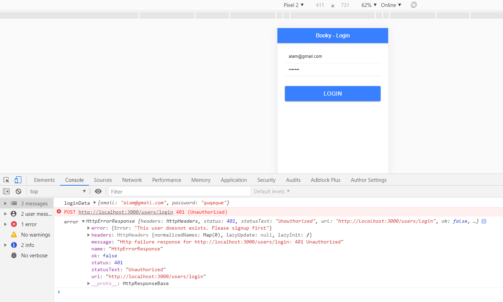
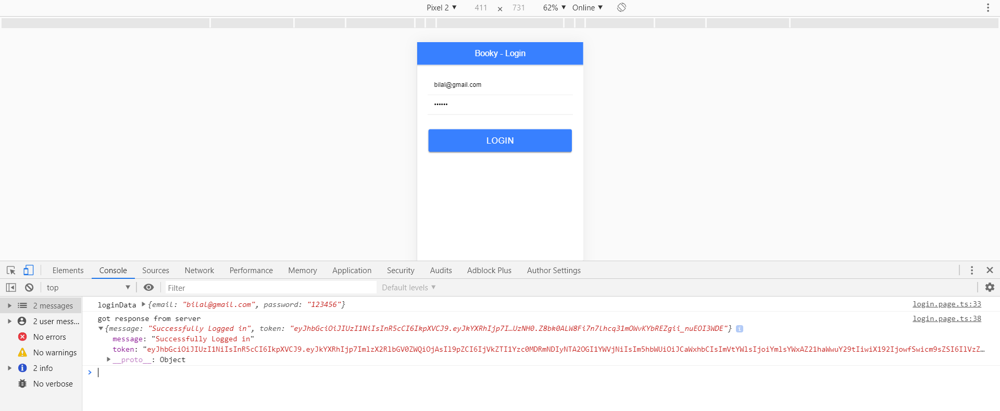
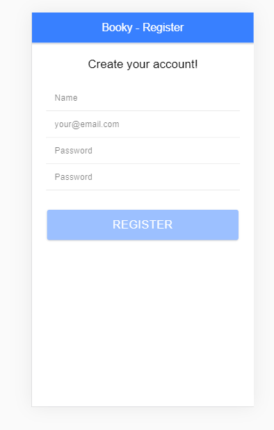
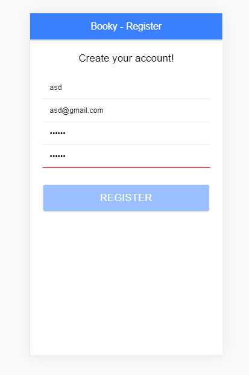

This is the part 5 of post [Intro to Nodejs - part 4](https://alamgirqazi.github.io/tech-blog/intro-to-nodejs-part-4/).

In this post, we will connect our Node.js App with an Ionic app. Most software development is done like this: Different teams works on different parts of the application. For e.g There will be a back-end team which will only focus building backends. Their focus will solely be on Node.js (or whatever language they use), Database (MongoDB or anyother). Same way, there will be different teams for Front-end Web whether its in React.js, Angular or any other framework. Again, different team for Mobile which can be hybrid or native.

In first 4 posts, we were only concerned with back-end. Now we will see some front-end and see how the whole picture fits. We will use Ionic app but later we will see how easily we can reuse functionalities with our Web app if its in Angular.

so lets start.

first, lets create an ionic application from scratch.

```
ionic start booky-ionic
```

Since we are going to be creating an API for books, I'm naming our project `Booky`. `Booky-ionic` will be our ionic code. aur node.js project could have the name Booky-node or whatever. It's upto you.

Usually its preferable we use different repositories for Ionic apps, front-end app and backend apps. Different repositories help us manage them more easily.

So in our case, we will have 2 repositories. In case, we build an Angular web app, we might need a third named `Booky-angular` but we'll see when we get there.

Okay so we used a starter with side-menu by default.

Lets clean things up a bit. I'm deleting lists folder because I don't need it. I also have to remove the link from `app-routing.module.ts`

First thing, we need to create a login page.

```
ionic g page login
```

lets also go ahead a create a register page.

```
ionic g page register
```

All set. lets add some html code in login page.

```

<ion-header>
  <ion-toolbar color="primary">
    <ion-title class="ion-text-center">Booky - Login</ion-title>
  </ion-toolbar>
</ion-header>

<ion-content color="">
  <form>
    <ion-grid>
      <ion-row color="justify-content-center">
        <ion-col class="ion-align-self-center" size-md="6" size-lg="5" size-xs="12">

          <div class="ion-padding">

            <ion-item>
              <ion-input name="email" type="email" placeholder="your@email.com"></ion-input>
            </ion-item>
            <ion-item>
              <ion-input name="password" type="password" placeholder="Password"></ion-input>
            </ion-item>
          </div>
          <div class="ion-padding">
            <ion-button size="large" color="primary" type="submit" expand="block">Login</ion-button>
          </div>
        </ion-col>
      </ion-row>
    </ion-grid>
  </form>
</ion-content>

```

We just added simple HTML for now. no forms etc just yet.

This is how it looks



Looks neat.

lets add Angular Reactive Forms.

`login.page.ts`

```
import { Component, OnInit } from '@angular/core';
import { FormBuilder, Validators } from '@angular/forms';

import { FormGroup } from '@angular/forms';

@Component({
  selector: 'app-login',
  templateUrl: './login.page.html',
  styleUrls: ['./login.page.scss']
})
export class LoginPage implements OnInit {
  constructor(private formBuilder: FormBuilder) {}
  loginForm: FormGroup;

  ngOnInit() {
    this.formInitializer();
  }

  formInitializer() {
    this.loginForm = this.formBuilder.group({
      email: [null, [Validators.required, Validators.email]],
      password: [null, [Validators.required]]
    });
  }
}

```

remember, we have to add ReactiveFormsModule import in `login.module.ts`

```
@NgModule({
  imports: [
    CommonModule,
    FormsModule,
    ReactiveFormsModule,
    IonicModule,
    LoginPageRoutingModule
  ],
  declarations: [LoginPage]
})

```

Okay, that's good. Now we need to add the form controls into HTML of `login.page.ts`

Here's after adding FormControlNames and FormGroup

```
<ion-content color="">
  <form [formGroup]="loginForm">
    <ion-grid>
      <ion-row color="justify-content-center">
        <ion-col class="ion-align-self-center" size-md="6" size-lg="5" size-xs="12">

          <div class="ion-padding">

            <ion-item>
              <ion-input name="email" formControlName="email" type="email" placeholder="your@email.com"></ion-input>
            </ion-item>
            <ion-item>
              <ion-input name="password" formControlName="password" type="password" placeholder="Password"></ion-input>
            </ion-item>
          </div>
          <div class="ion-padding">
            <ion-button size="large" [disabled]="loginForm.invalid" (click)="save()" color="primary" type="submit" expand="block">Login
            </ion-button>
          </div>
        </ion-col>
      </ion-row>
    </ion-grid>
  </form>
</ion-content>

```

We also added a save() function on click. The click will only trigger if the form is valid.

Lets write some logic

```
  save() {
    const loginData = this.loginForm.value;
    console.log('loginData', loginData);
  }

```

What we need to do now is send a request to Booky-Node (our backend). We need to send a request to [localhost:3000/users/login](localhost:3000/users/login).

We need to do an API request.

So for API requests, we need services.

Lets create a `User` service.

```

ionic g service user

```

Awesome. Two files will be created for us.

However, to make services more manageable, we will move them in proper folder structure.

Here's what I do

create an `sdk` folder inside `app` directory.

create a file named `booky.config.ts`

create a folder named `core`

This will contain core services

create a folder named `custom`

This will contain our custom services e.g User, Books etc

This is what the folder structure looks like



Our config file is empty. Lets add some boilerplate code

```
export class BookyConfig {
  private static path = 'http://localhost:3000';

  public static getPath(): string {
    return BookyConfig.path;
  }
}

```

The purpose of this is that whenever our backend URL changes, for e.g our backend is live at `api.booky.com`, then we only need to make a change in one file and all URLs will be updated.

Ok, so lets move on.

we created a user service but its in outer app folder. There was also a .spec file. I'll just delete the .spec file and move the `user.service.ts` file to `sdk -> custom -> user.service.ts`



This also keeps the services organized.

Okay, so for user, we need to create a service method for login

Here's how `user.service.ts` file looks

```
import { HttpClient, HttpHeaders } from '@angular/common/http';

import { BookyConfig } from '../booky.config';
import { Injectable } from '@angular/core';
import { Observable } from 'rxjs';

@Injectable({
  providedIn: 'root'
})
export class UserService {
  constructor(private http: HttpClient) {}

  public userLogin(credentials: object): Observable<any> {

    // this url will be http://localhost:3000/users/login
    const url = BookyConfig.getPath() + '/users/login';

    return this.http.post(url, credentials);
  }
}


```

After this, I need to import `HttpClientModule` in imports of app.module.ts because we are using it in service.

```
import { HttpClientModule } from '@angular/common/http';
```

Lets go to login.page.ts and write the `.subscribe` method

```
save() {
    const loginData = this.loginForm.value;
    console.log('loginData', loginData);
    // we need to send this data to our node.js server

    this.userService.userLogin(loginData).subscribe(
      data => {
        console.log('got response from server', data);
        this.loading = false;
      },
      error => {
        this.loading = false;
        console.log('error', error);
      }
    );
  }

```

lets go to [localhost:8100/login](localhost:8100/login) and see if it works



BOOM ! We successfully connected our ionic app with our backend. Hurray !! Lets also add Full stack developer to our CV while we're at it :)

lets get back.

we got 401 unauthorized error. We can also see our custom message 'Please signup first' in the console.

Lets try it with a user that already exists.



Awesome. We get success message. After login, we're not doing anything right now. we should however take it to a different page. something like /books where we can see our own books but right now we'll just navigate it home page.

we need to do two things here which we're not doing right now. 1. we need to save the JWT token from the server. That's how we will know which user it is. 2. We are not showing any loading screen for now. It's all happening very quick. We should add a loader.

We'll come back to this later.

Lets just write that navigate method and we'll move to register page.

add these

```

import { Router } from '@angular/router';


constructor ( private router: Router)

 this.userService.userLogin(loginData).subscribe(
      data => {
        console.log('got response from server', data);
        this.loading = false;
        this.router.navigateByUrl('/home');
      },
      error => {
        this.loading = false;
        console.log('error', error);
      }
    );

```

Ok. so far so good. We need to provide users a way to signup from the ionic app. Lets add code to that `register` page we created.

Here is register.page.html

```

<ion-header>
  <ion-toolbar color="primary">
    <ion-title class="ion-text-center">Booky - Register</ion-title>
  </ion-toolbar>
</ion-header>

<ion-content color="">
  <form [formGroup]="registerForm">
    <ion-grid>
      <ion-row color="justify-content-center">
        <ion-col class="ion-align-self-center" size-md="6" size-lg="5" size-xs="12">
          <div class="ion-text-center">
            <h3>Create your account!</h3>
          </div>
          <div class="ion-padding">
            <ion-item>
              <ion-input name="name" formControlName="name" type="text" placeholder="Name"></ion-input>
            </ion-item>
            <ion-item>
              <ion-input name="email" formControlName="email" type="email" placeholder="your@email.com"></ion-input>
            </ion-item>
            <ion-item>
              <ion-input name="password" formControlName="password" type="password" placeholder="Password"></ion-input>
            </ion-item>
            <ion-item>
              <ion-input name="password" formControlName="confirm_password" type="password" placeholder="Password">
              </ion-input>
            </ion-item>
          </div>
          <div class="ion-padding">
            <ion-button size="large" [disabled]="registerForm.invalid" (click)="save()" color="primary" type="submit"
              expand="block">Register
            </ion-button>
          </div>
        </ion-col>
      </ion-row>
    </ion-grid>
  </form>
</ion-content>

```

Here is what the view looks like



lets write some typescript code

```

import { AbstractControl, FormBuilder, Validators } from '@angular/forms';
import { Component, OnInit } from '@angular/core';

import { FormGroup } from '@angular/forms';
import { Subscription } from 'rxjs';

@Component({
  selector: 'app-register',
  templateUrl: './register.page.html',
  styleUrls: ['./register.page.scss']
})
export class RegisterPage implements OnInit {
  constructor(private formBuilder: FormBuilder) {}
  registerForm: FormGroup;

  ngOnInit() {
    this.formInitializer();
  }

  formInitializer() {
    this.registerForm = this.formBuilder.group({
      name: ['', [Validators.required]],
      email: ['', [Validators.required, Validators.email]],
      password: ['', [Validators.required, Validators.minLength(5)]],
      confirm_password: [
        '',
        [
          Validators.required,
          Validators.minLength(5),
          this.matchOtherValidator('password')
        ]
      ]
    });
  }

  matchOtherValidator(otherControlName: string) {
    return (control: AbstractControl): { [key: string]: any } => {
      const otherControl: AbstractControl = control.root.get(otherControlName);

      if (otherControl) {
        const subscription: Subscription = otherControl.valueChanges.subscribe(
          () => {
            control.updateValueAndValidity();
            subscription.unsubscribe();
          }
        );
      }

      return otherControl && control.value !== otherControl.value
        ? { match: true }
        : null;
    };
  }
}


```

A couple of new things were added to this. I used a custom validator. Don't worry I didn't wrote it myself :) I just copy / pasted from Stackoverflow :) Full Stackoverflow developer :D


Okay, coming back to this

Our scenario, which we often see in some apps is that you need to write password two times. and comparing both of them is not that straight-forward when it comes to making it work with the custom validations that we already use. Lets see it in action.



It not enabling the register button and we can see the red line because the passwords I typed didnot match. We are able to handle it quite easily and gracefully in Angular.

Right, we need to save() method and also add a register method in `user.service.ts`

Lets add this method

```
public userRegister(credentials: object): Observable<any> {
    const url = BookyConfig.getPath() + '/users/register';

    return this.http.post(url, credentials);
  }

```

Lets write that save method

```
save() {
    this.loading = true;

    this.userService.userRegister(this.registerForm.value).subscribe(
      data => {
        console.log('got response from server', data);
        this.loading = false;
        this.router.navigateByUrl('/home');
      },
      error => {
        this.loading = false;
        console.log('error', error);
      }
    );
  }

```

Again once our register is succeessful, we need to navigate it to `/home` page or eventually `/books` page.

We covered a lot in this post. Few things we will cover in the next part are

1. Showing proper Error Messages to user and success message
2. Showing some loader
3. saving JWT Token
4. Complete Books API integration

Here's [link](https://github.com/alamgirqazi/intro-to-nodejs-part4) to the ionic app code.
