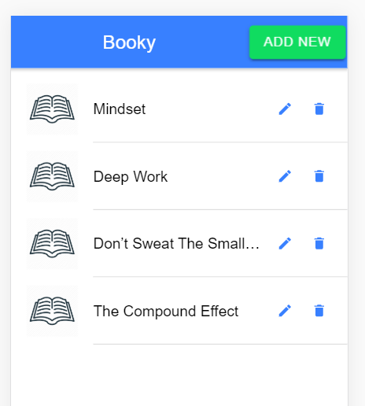

This is the part 6 of post [Intro to Nodejs - part 5](https://alamgirqazi.github.io/tech-blog/intro-to-nodejs-part-5/).

In this post, we will integrate our Books API with all CRUD (Create, Read, Update and Delete) operations with our Ionic App.

So lets get started.

We will use that Node.js app we used for User Login and Signup.

```

git clone https://github.com/alamgirqazi/intro-to-nodejs-part4.git

```

I'll quickly do a couple of things.

1. change the folder name to node-part6
2. delete .git folder.
3. update package.json name to node-part6
4. yarn install or npm install

Before we start our app, we need to create a local .env file.

lets create that and add contents from sample.env file.

my .env file looks like

```
JWT_KEY = SecretjwtKey
PORT = 3000

mongoCon = mongodb://localhost:27017/bookyapp

```

Lets start our app

```
nodemon app
```

Great, our app is up and running.

Previously, we set up a complete Books API on Node.js in part 4.

Lets use that with the Ionic app we built in part 5.

now, separately, I will use that ionic app. You can optionally clone from here (https://github.com/alamgirqazi/booky-ionic) but I will just use from the previous part.

lets run our app via

```
ionic serve

```

lets create a new page named books

```

ionic g page books

```

first, we need to display a list of books that are already in the database

we need to create a user service. Instead of `ionic g service user` , I'll just copy and paste the user.service.ts we already have.

Here's how my books.service.ts looks like

```
import { HttpClient, HttpHeaders } from '@angular/common/http';

import { BookyConfig } from '../booky.config';
import { Injectable } from '@angular/core';
import { Observable } from 'rxjs';

@Injectable({
  providedIn: 'root'
})
export class BooksService {
  constructor(private http: HttpClient) {}

  public getAllBooks(): Observable<any> {
    const url = BookyConfig.getPath() + '/books';

    return this.http.get(url);
  }
}

```

Ok, lets head over to books.page.html and write some HTML.

what we need now is to display a list. We'll use `ion-list`.

Here's books.page.html

```

<ion-header>
  <ion-toolbar color="primary">
    <ion-title class="ion-text-center">Booky</ion-title>
  </ion-toolbar>
</ion-header>

<ion-content color="">

  <ion-list>
    <ion-item *ngFor="let book of books">
      <ion-thumbnail slot="start">
        <ion-img [src]="book.image_url"></ion-img>
      </ion-thumbnail>
      <ion-label>{{book.name}}</ion-label>
      <ion-icon name="create" slot="end"></ion-icon>
      <ion-icon name="trash" slot="end"></ion-icon>
    </ion-item>
  </ion-list>

</ion-content>

```

We need to add TS code now

```
import { Component, OnInit } from '@angular/core';

import { BooksService } from '../../sdk/custom/books.service';

@Component({
  selector: 'app-books',
  templateUrl: './books.page.html',
  styleUrls: ['./books.page.scss']
})
export class BooksPage implements OnInit {
  loading = false;
  books: Books[] = [];
  constructor(private booksService: BooksService) {}

  ngOnInit() {
    this.getAll();
  }

  getAll() {
    this.loading = true;

    this.booksService.getAllBooks().subscribe(
      data => {
        console.log('got response from server', data);
        this.loading = false;
        this.books = data.data.docs;
      },
      error => {
        this.loading = false;
        console.log('error', error);
      }
    );
  }
}

// Intefacing is Optional

interface Books {
  name: string;
  ibn: string;
  image_url: string;
  author: string;
  is_deleted: boolean;
}

```

You must be familiar with most the code above. We added one extra thing. We added an interface for Books. This helps us catch errors during compile time and not run time.

So this is what it looks like


Nice. we're able to get the data from the API and display it here. GET looks set.

Few things we should add here. THere's no loading display. we can use ion-skeleton for this.

we are keeping the loading state in the variable `loading`. We are manually turning it true and false. We display the ion-skeleton only when its loading.

lets update our HTML.

```
<ion-header>
  <ion-toolbar color="primary">
    <ion-title class="ion-text-center">Booky</ion-title>
  </ion-toolbar>
</ion-header>

<ion-content color="">
  <div *ngIf="!loading">

    <ion-list>
      <ion-item *ngFor="let book of books">
        <ion-thumbnail slot="start">
          <ion-img [src]="book.image_url"></ion-img>
        </ion-thumbnail>
        <ion-label>{{book.name}}</ion-label>
        <ion-icon name="create" slot="end"></ion-icon>
        <ion-icon name="trash" slot="end"></ion-icon>
      </ion-item>
    </ion-list>
  </div>

  <div *ngIf="loading">


    <ion-list>


      <ion-item *ngFor="let item of skeletonlist">
        <ion-thumbnail slot="start">
          <ion-skeleton-text animated></ion-skeleton-text>
        </ion-thumbnail>
        <ion-label>
          <h3>
            <ion-skeleton-text animated style="width: 50%"></ion-skeleton-text>
          </h3>
          <p>
            <ion-skeleton-text animated style="width: 80%"></ion-skeleton-text>
          </p>
          <p>
            <ion-skeleton-text animated style="width: 60%"></ion-skeleton-text>
          </p>
        </ion-label>
      </ion-item>

    </ion-list>
  </div>
</ion-content>

```

This is how the loading looks. Kinda nice right.


Once thing you can notice when the images load is that the broken image looks really bad. How about we add a custom icon in case the image isn't there?

Download any book icon from the internet. Or you can use this


download this. copy it to `SRC -> Assets -> Icon`.

lets display it incase our image doesnot load.

we need to add its path in book.page.ts

here's a quick hacky way

```
       <ion-thumbnail slot="start">
          <ion-img *ngIf="book.image_url && book.image_url!='null'" [src]="book.image_url">
          </ion-img>
          <ion-img *ngIf="!book.image_url ||  book.image_url=='null' " [src]="'assets/icon/book.png'">
          </ion-img>
        </ion-thumbnail>


```

Now it looks much cleaner


Ok. Lets add a book to our database.

we need an Add button. and we need to open another page or maybe a popup. A popup seems fine.

lets update our toolbar

```

 <ion-toolbar color="primary">
    <ion-title class="ion-text-center">Booky</ion-title>
    <ion-button slot="end" color="success">
      Add New </ion-button>
  </ion-toolbar>

```

Lets add a new add new page

```

ionic g page books/addnewbook

```

We can see that the component has been created.


We need to define it in books.module.ts

```

import { AddnewbookComponent } from './addnewbook/addnewbook.component';
import { BooksPage } from './books.page';
import { BooksPageRoutingModule } from './books-routing.module';
import { CommonModule } from '@angular/common';
import { FormsModule } from '@angular/forms';
import { IonicModule } from '@ionic/angular';
import { NgModule } from '@angular/core';

@NgModule({
  imports: [CommonModule, FormsModule, IonicModule, BooksPageRoutingModule],
  declarations: [BooksPage, AddnewbookComponent],
  entryComponents: [AddnewbookComponent]
})
export class BooksPageModule {}

```

I added one more thing here. _entryComponents_.

### EntryComponents

An entry component is any component that Angular loads imperatively by type.

A component loaded declaratively via its selector is not an entry component.

We will load this component not via HTML but by TS so we need to add it to entryComponents.

Ok, lets add a method to that _Add new_ Button on the toolbar.

```

<ion-toolbar color="primary">
    <ion-title class="ion-text-center">Booky</ion-title>
    <ion-button slot="end" (click)="openAddModal()" color="success">
      Add New </ion-button>
  </ion-toolbar>

```

Lets write some code for openAddModal()

```
 async openAddModal() {
    const modal = await this.modalController.create({
      component: AddnewbookComponent
    });
    return await modal.present();
  }

```

For this to work, we need to update our constructor

```
 constructor(
    private booksService: BooksService,
    private modalController: ModalController
  ) {}

```

and also add the imports at the top.

```


import { AddnewbookComponent } from './addnewbook/addnewbook.component';
import { BooksService } from '../../sdk/custom/books.service';
import { ModalController } from '@ionic/angular';

```

Ok. lets see it in action.


It worked. But there is alot of work to be done.

Lets add HTML form

```
<ion-header>
  <ion-toolbar color="primary">
    <ion-buttons slot="start">
      <ion-back-button [text]="'cancel'" (click)="dismiss()" defaultHref="books"></ion-back-button>
    </ion-buttons>

  </ion-toolbar>
</ion-header>

<ion-content color="">
  <form [formGroup]="addNewBookForm">
    <ion-grid>
      <ion-row color="justify-content-center">
        <ion-col class="ion-align-self-center" size-md="6" size-lg="5" size-xs="12">
          <div class="ion-text-center">
            <h3>Add New Book</h3>
          </div>
          <div class="ion-padding">
            <ion-item>
              <ion-input formControlName="name" type="text" placeholder="Name"></ion-input>
            </ion-item>
            <ion-item>
              <ion-input formControlName="ibn" type="text" placeholder="IBN Number"></ion-input>
            </ion-item>
            <ion-item>
              <ion-input formControlName="author" type="text" placeholder="author"></ion-input>
            </ion-item>
            <ion-item>
              <ion-input formControlName="image_url" type="text" placeholder="image url">
              </ion-input>
            </ion-item>

          </div>
          <div class="ion-padding">
            <ion-button size="large" [disabled]="addNewBookForm.invalid" (click)="save()" color="primary" type="submit"
              expand="block">SAVE !
            </ion-button>
          </div>
        </ion-col>
      </ion-row>
    </ion-grid>
  </form>
</ion-content>

```

Let adds the TS code

```

import { Component, OnInit } from '@angular/core';
import { FormBuilder, FormGroup, Validators } from '@angular/forms';

import { ModalController } from '@ionic/angular';

@Component({
  selector: 'app-addnewbook',
  templateUrl: './addnewbook.component.html',
  styleUrls: ['./addnewbook.component.scss']
})
export class AddnewbookComponent implements OnInit {
  constructor(
    private modalCtrl: ModalController,
    private formBuilder: FormBuilder
  ) {}

  addNewBookForm: FormGroup;
  loading = false;

  ngOnInit() {
    this.formInitializer();
  }

  formInitializer() {
    this.addNewBookForm = this.formBuilder.group({
      name: [null, [Validators.required]],
      ibn: [null, [Validators.required]],
      author: [null, [Validators.required]],
      is_deleted: [false, [Validators.required]],
      image_url: [null]
    });
  }

  save() {}

  dismiss() {
    this.modalCtrl.dismiss({
      dismissed: true
    });
  }
}
// Intefacing is Optional

interface Books {
  name: string;
  ibn: string;
  image_url: string;
  author: string;
  is_deleted: boolean;
}


```

make sure to add _ReactiveFormsModule_ to the imports of Books.module.ts


I think this looks real nice. Lets get to the sweet part. Integrating it with our backend.

We need to save a new book into our database.

1. Create a POST method is Books.service.ts
2. write save() function just like register function.

Lets start

If we see our Nodejs project, books.routes.js file

```
router.post("/add",bookController.addBook);
```

that means /add for Adding a new book.

lets write the service function

```
  public addNewBook(data: object): Observable<any> {
    const url = BookyConfig.getPath() + '/books/add';

    return this.http.post(url, data);
  }

```

Lets write the save function

```

 save() {
    this.loading = true;

    this.booksService.addNewBook(this.addNewBookForm.value).subscribe(
      data => {
        console.log('got response from server', data);
        this.loading = false;
      },
      error => {
        this.loading = false;
        console.log('error', error);
      }
    );
  }

```

lets try this


Yaaaaaay !!!

We got the response. Book saved.

If we refresh the page, we will see the new book added.

Oh My!


That's nice.

However our experience could be better. We should clear the form, show some toast, and maybe dismiss the modal ?

Lets add a spinner like


and a toast like


lets update our HTML

```

 <ion-button size="large" [disabled]="addNewBookForm.invalid" (click)="save()" color="primary" type="submit"
              expand="block">SAVE ! &nbsp;<ion-spinner *ngIf="loading"></ion-spinner>

            </ion-button>

```

And our TS file. all our logic is here.

```

  save() {
    this.loading = true;

    this.booksService.addNewBook(this.addNewBookForm.value).subscribe(
      async data => {
        console.log('got response from server', data);
        const name = this.addNewBookForm.controls['name'].value;
        const toast = await this.toastController.create({
          message: `${name} has been saved successfully.`,
          duration: 3500
        });
        toast.present();
        this.loading = false;
        this.addNewBookForm.reset();
        //optional

        this.modalCtrl.dismiss();
      },
      error => {
        this.loading = false;
        console.log('error', error);
      }
    );
  }

```

This works great. We are redirected back to the page. However, there is one problem.

Our list hasn't been updated.

So for that, we need to listen to event so when the modal gets dismissed, we know.

lets update our modal code in books.page.ts

```
async openAddModal() {
    const modal = await this.modalController.create({
      component: AddnewbookComponent
    });
    modal.onDidDismiss().then(data => {
      console.log('dismissed', data);
      this.getAll();
    });
    await modal.present();
  }
}

```

Now that's amazing.

We've done quite a lot.

2 more things we need to do to complete. Delete and Edit.

Lets start with the delete functionality. We already have a delete button, we just need to add a confirmation popup and then delete.

First, we don't have the delete API method in Node.js. Lets create that.

lets open our Node.js app and open books.controllers.js

Surprise! There is already a delete method by the name of `deletebook`. I just made one change.

```
    const result = await Books.findOneAndDelete({
```

I capitalized Books. otherwise, it wouldn't work. Here's the complete method. `findOneAndDelete` is a mongoose (ORM) method that updates a single document / table in MongoDB.

```
booksController.deleteBook = async (req, res) => {
  if (!req.params._id) {
    Fu;
    res.status(500).send({
      message: 'ID missing'
    });
  }
  try {
    const _id = req.params._id;

    const result = await Books.findOneAndDelete({
      _id: _id
    });

    res.status(200).send({
      code: 200,
      message: 'Deleted Successfully'
    });
  } catch (error) {
    console.log('error', error);
    return res.status(500).send(error);
  }
};


```

To expose this method, lets open books.routes.ts

Lets uncomment this line

```
router.delete("/:_id", bookController.deleteBook);

```

Now, if we make a `delete` request to localhost:3000/books/12312313123

then that user will be deleted.

To do this in our Ionic app, we need to create a `delete`service method for books.

```
  public deleteBook(id: string): Observable<any> {
    const url = BookyConfig.getPath() + `/books/${id}`;

    return this.http.delete(url);
  }

```

Let update our HTML

```
  <ion-button fill="clear">
          <ion-icon name="create" slot="end"></ion-icon>
        </ion-button>
        <ion-button fill="clear" (click)="delete(book)">
          <ion-icon name="trash" slot="end"></ion-icon>
        </ion-button>
```

Lets write code on that delete button

```

 async delete(book) {
    this.selectedBook = book;
    const alert = await this.alertController.create({
      header: 'Confirm!',
      message: `Are you sure you want to delete the book "${book.name}"`,
      buttons: [
        {
          text: 'Cancel',
          role: 'cancel',
          cssClass: 'secondary',
          handler: blah => {
            console.log('Confirm Cancel: blah');
          }
        },
        {
          text: 'Okay',
          handler: () => {
            this.deleteBook();
          }
        }
      ]
    });
    await alert.present();
  }

  deleteBook() {
    this.deleteLoading = true;
    this.booksService.deleteBook(this.selectedBook._id).subscribe(
      data => {
        console.log('got response from server', data);
        this.deleteLoading = false;
        this.getAll();
      },
      error => {
        this.deleteLoading = false;
        console.log('error', error);
      }
    );
  }

```


Yesssss. Our delete functionality is working.



Great. So One last thing. Edit.

For edit, we will use that component we created already.

Lets edit the html and add a function

```

    <ion-button (click)="openEditPopup(book)" fill="clear">
          <ion-icon name="create" slot="end"></ion-icon>
        </ion-button>

```

Now lets add some functionality.

We will be doing a little bit of magic. We will use how we can reuse functions. I will use 1 function for 2 scenarios.

```
openEditPopup(book: Books) {
    this.openAddModal(book);
  }

  async openAddModal(book?: Books) {
    const modal = await this.modalController.create({
      component: AddnewbookComponent,
      componentProps: { book }
    });
    modal.onDidDismiss().then(data => {
      console.log('dismissed', data);
      this.getAll();
    });
    await modal.present();
  }
```

This saves me writing a lot of code. I just open the modal using same function.

I pass 'book' as optional parameter.

`componentProps` help us send data to that component. We can access there using @Input() book.

after the popup opens, we need to patch the data to our form.

updated addnewbook.component.ts

```

 @Input() book;
  ngOnInit() {
    this.formInitializer();
    if (this.book) {
      console.log('got book', this.book);
      this.addNewBookForm.patchValue(this.book);
    }
  }

  formInitializer() {
    this.addNewBookForm = this.formBuilder.group({
      _id: [null],
      name: [null, [Validators.required]],
      ibn: [null, [Validators.required]],
      author: [null, [Validators.required]],
      is_deleted: [false, [Validators.required]],
      image_url: ['']
    });
  }

```

I added a \_id field. its not required.

Every record created in MongoDB has a unique `_id`.

The best thing is there is no need of sequence like in Mysql or Postgresql. MongoDB manages unique IDs itself.

We will use that ID.


Click on edit button now opens that book with its data. that's amazing.

Although I see `Add New Book` here which is wrong.

Also clicking on Save would not work because we are calling ADD api when we should be calling EDIT api.

We will change that.

First we update the text at the top.

we know that in edit case, `this.books` exists.

we will use that.

```
     <div class="ion-text-center">
            <h3 *ngIf="!book">Add New Book</h3>
            <h3 *ngIf="book">Edit Book</h3>
          </div>

```


This was so simple. All we needed was very little logic

Lets update our Edit and Add button.

Here is how our save() function looks like

```
  save() {
    this.loading = true;

    if(this.book){
      this.updateBook();
    }
    else{
      this.addNew();
    }


  }

```

and those two functions

```

  addNew(){
  this.booksService.addNewBook(this.addNewBookForm.value).subscribe(
    async data => {
      console.log('got response from server', data);
      const name = this.addNewBookForm.controls['name'].value;
      const toast = await this.toastController.create({
        message: `${name} has been added successfully.`,
        duration: 3500
      });
      toast.present();
      this.loading = false;
      this.addNewBookForm.reset();
      //optional

      this.modalCtrl.dismiss();
    },
    error => {
      this.loading = false;
      console.log('error', error);
    }
  );
}
updateBook(){
  this.booksService.updateBook(this.addNewBookForm.value).subscribe(
    async data => {
      console.log('got response from server', data);
      const name = this.addNewBookForm.controls['name'].value;
      const toast = await this.toastController.create({
        message: `${name} has been updated successfully.`,
        duration: 3500
      });
      toast.present();
      this.loading = false;
      this.addNewBookForm.reset();
      //optional

      this.modalCtrl.dismiss();
    },
    error => {
      this.loading = false;
      console.log('error', error);
    }
  );
}

```

This is great. We still need to create that Update function in our service. Before that, lets see if its added in our Node.js app.

add this line to books.routes.js

```
  router.put("/:_id", bookController.updateBook);
```

books.controllers.js

```

booksController.updateBook = async (req, res) => {
if (!req.params.\_id) {
res.status(500).send({
message: 'ID missing'
});
}
try {
const \_id = req.params.\_id;
let updates = req.body;
runUpdate(\_id, updates, res);
} catch (error) {
console.log('error', error);
return res.status(500).send(error);
}
};

async function runUpdate(\_id, updates, res) {
try {
const result = await Books.updateOne(
{
\_id: \_id
},
{
\$set: updates
},
{
upsert: true,
runValidators: true
}
);

    {
      if (result.nModified == 1) {
        res.status(200).send({
          code: 200,
          message: 'Updated Successfully'
        });
      } else if (result.upserted) {
        res.status(200).send({
          code: 200,
          message: 'Created Successfully'
        });
      } else {
        res.status(422).send({
          code: 422,
          message: 'Unprocessible Entity'
        });
      }
    }

} catch (error) {
console.log('error', error);
return res.status(500).send(error);
}
}

```

Great.

Lets add the service method.

```
public updateBook(data: object): Observable<any> {
const url = BookyConfig.getPath() + `/books/${id}`;

    return this.http.put(url, data);

}
```

I think this should work.


Yesssssss. We finally did it.

We completed the whole Books API.

This post was alot of work but we eventually did it.

We covered a lot of things but were finally able to complete the API.

Here's [link](https://github.com/alamgirqazi/intro-to-nodejs-part6) to the node.js app code.

Here's [link](https://github.com/alamgirqazi/booky-ionic/tree/part6) to the ionic app code. (_branch part6_)

In the next part, we will cover Guards and Authentication. Only the user who logged in should see the books list and should only be able to add/edit/delete. We will discuss concepts like Authentication, Authorization, Guards and Interceptors.

In part 8, we will deploy our App.

We will deploy our MongoDB Database to mlab / MongoDB Atlas

we will deploy our Node.js app to Heroku. There are also other platforms like Now.sh, Digital Occean, AWS Cloud, Google Cloud.
