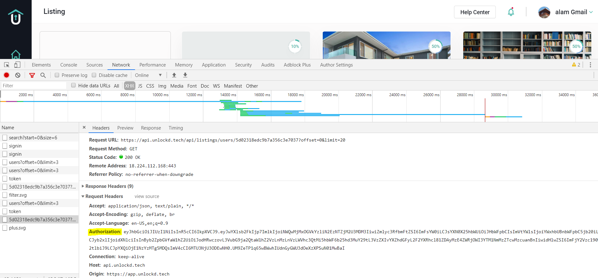
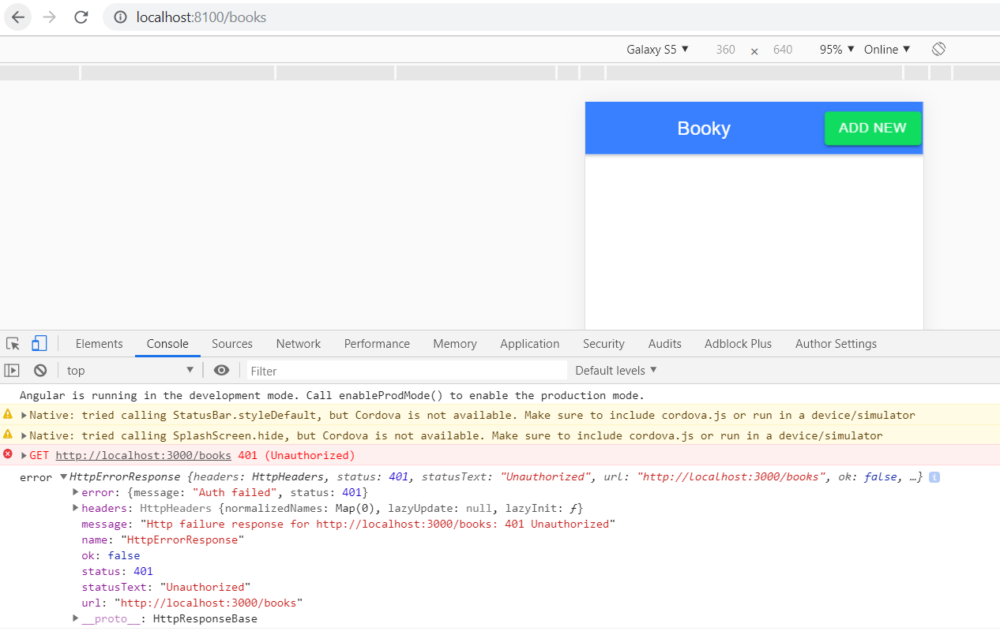
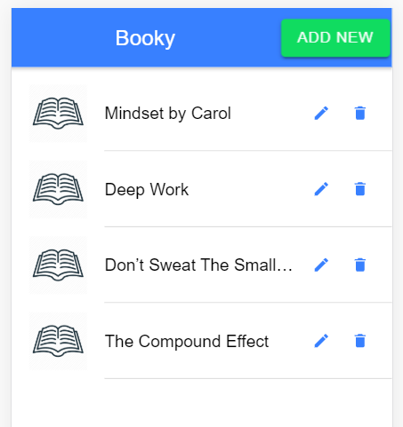
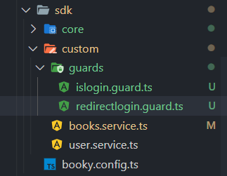
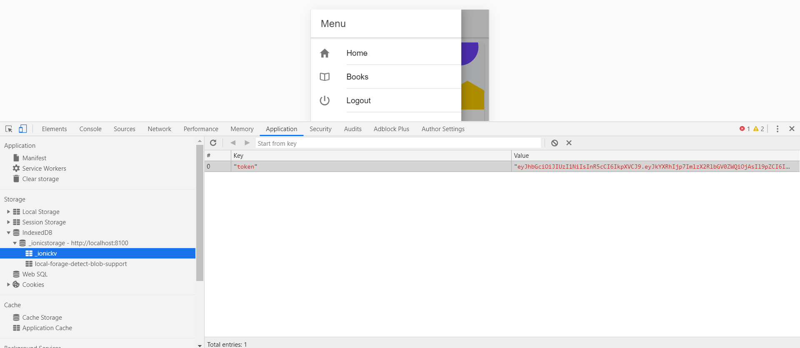

This is the part 7 of post [Intro to Nodejs - part 6](https://alamgirqazi.github.io/tech-blog/intro-to-nodejs-part-6/).

So lets get started.

In the next part, we will cover Guards and Authentication. Only the user who are logged in should see the books list and should only be able to add/edit/delete. We will discuss concepts like Authentication, Authorization, Guards and Interceptors.

First, we need to protect our backend.

Only authorized users should have access to Books List right. Only authorized users can add/update/delete books from the database.

How do we do it?

Remember, we created a JWT Token when we login? we will use that token and save in our "local Storage".

Once token is saved, every request is sent with an authorization header. That includes our credentials.

Here is an example



do you see the highlighted part? thats the JWT Token. every request includes that token. Without that token, that server will throw a 401 or 403 HTTP Error stating you do not have access to this resource.

We need to incorporate that in our app.

lets first setup our application. we will use that same Ionic and Node app from previous part.

We need to add a check in our Node.js / Express app. That check will check if the request that Authorization token in it. If it doesnot, then it will throw an error.

We use _middlewares_ for that.

The main idea of middlewares is that every request goes through middleware before executing our method.

Lets see some code to get a better idea.

```
const checkAuth = require('../middleware/check-auth');

router.get("/",checkAuth, bookController.getAll);

```

When we go to localhost:3000/books

then first `checkAuth` will run. After that, `UserController.getAll` will run.

If any error then checkAuth will throw the error and it won't touch `UserController.getAll`. That's it. that's all the logic.

lets also make one change in our code.

in users.controller.js

```
 const token = jsonwebtoken.sign({
               data: result,
               role: 'User'
            }, process.env.JWT_KEY, { expiresIn: '7d' });

```

make sure we use `process.env.JWT_KEY` instead of previously `supersecretToken`

Lets take a look at `checkAuth` middleware.

```
const jwt = require('jsonwebtoken');

module.exports = (req, res, next) => {
    try {
        const token = req.headers.authorization;
        const decoded = jwt.verify(token, process.env.JWT_KEY);
        req.userData = decoded;
        next();
    } catch (error) {
        next({
            message: 'Auth failed',
            status: 401
        });
    }
};

```

we get that authorization from `req.headers`.

we decode it using the jwt library.

if there is no token or it has expired, then it will throw the error.

Lets see this in action.



we get a 401 error. We don't see our books list anymore.

For that to happen, we first need to save our JWT token after we login into local Storage or ionic Storage.

lets do that.

lets create an `auth.service.ts` file in sdk -> core folder.

lets install these to access ionic storage.

```
ionic cordova plugin add cordova-sqlite-storage

npm install @ionic/storage
```

to use it in our service file, we need to import it in app.module.ts

```

imports: [
    BrowserModule,
    IonicModule.forRoot(),
    IonicStorageModule.forRoot(),
    HttpClientModule,
    AppRoutingModule
  ]

```

lets write code in our Auth.service.ts file

```
import { Injectable } from '@angular/core';
import { Storage } from '@ionic/storage';

@Injectable({
  providedIn: 'root'
})
export class AuthService {
  constructor(private storage: Storage) {}

  public saveTokenToStorage(token: string) {
    this.storage.set('token', token);
  }

  public async getTokenFromStorage() {
    return await this.storage.get('token');
  }
}

```

we will use this in login.page.ts

lets update our code. we just add one line. we get the token in data.token so

```
  data => {
        console.log('got response from server', data);
        this.loading = false;
        this.authService.saveTokenToStorage(data.token);
        this.router.navigateByUrl('/home');
      },

```

Nice. we still however need to add this token to our books request. Lets do that.

We will be changing our methods a little bit.

We first need to update our GET /books request.

lets go to `books.service.ts`

```
  public async getAllBooks(): Promise<any> {
    const url = BookyConfig.getPath() + '/books';
    const token = await this.authService.getTokenFromStorage();
    return this.http.get(url, {
      headers: new HttpHeaders().set('Authorization', token)
    });
  }
```

Few things we changed. We converted our Observable to Promise (because we had to use async/await for getting token from Ionic Storage).

we append that Token in our headers.

remember our Node.js middleware where we read `req.headers.authorization` ? that's what we are adding here.

We also updated the component method. Lets take a look.

books.page.ts

```

async getAll() {
    this.loading = true;

    const observable = await this.booksService.getAllBooks();
    observable.subscribe(
      data => {
        this.books = data.data.docs;
        this.loading = false;
        console.log('data', data);
      },
      err => {
        console.log('err', err);
      }
    );
  }

```

Now, our books should return.



Now, unless you login properly, the GET request won't work.

we need to add this to other methods as well in Node.js server.

`books.routes.js`

```
const checkAuth = require('../middleware/check-auth');

const bookController = require('../controllers/books.controllers');

router.get("/",checkAuth,bookController.getAll);
router.post("/add",checkAuth,bookController.addBook);
router.put("/:_id",checkAuth, bookController.updateBook);
router.delete("/:_id",checkAuth, bookController.deleteBook);

```

Now it will work for all.

we need to update our methods in Angular/Ionic as well.

books.service.ts

```
import { HttpClient, HttpHeaders } from '@angular/common/http';

import { AuthService } from './../core/auth.service';
import { BookyConfig } from '../booky.config';
import { Injectable } from '@angular/core';

@Injectable({
  providedIn: 'root'
})
export class BooksService {
  constructor(private http: HttpClient, private authService: AuthService) {}

  public async getAllBooks(): Promise<any> {
    const url = BookyConfig.getPath() + '/books';
    const token = await this.authService.getTokenFromStorage();
    return this.http.get(url, {
      headers: new HttpHeaders().set('Authorization', token)
    });
  }

  public async addNewBook(data: object): Promise<any> {
    const url = BookyConfig.getPath() + '/books/add';
    const token = await this.authService.getTokenFromStorage();

    return this.http.post(url, data, {
      headers: new HttpHeaders().set('Authorization', token)
    });
  }
  public async updateBook(data): Promise<any> {
    const url = BookyConfig.getPath() + `/books/${data._id}`;
    const token = await this.authService.getTokenFromStorage();

    return this.http.put(url, data, {
      headers: new HttpHeaders().set('Authorization', token)
    });
  }
  public async deleteBook(id: string): Promise<any> {
    const url = BookyConfig.getPath() + `/books/${id}`;
    const token = await this.authService.getTokenFromStorage();

    return this.http.delete(url, {
      headers: new HttpHeaders().set('Authorization', token)
    });
  }
}

```

Lets update the methods as well

books.page.ts

```

  async deleteBook() {
    this.deleteLoading = true;
    const observable = await this.booksService.deleteBook(
      this.selectedBook._id
    );

    observable.subscribe(
      data => {
        console.log('got response from server', data);
        this.deleteLoading = false;
        this.getAll();
      },
      error => {
        this.deleteLoading = false;
        console.log('error', error);
      }
    );
  }
  }
```

addnewbook.component.ts

```

  async addNew() {
    const observable = await this.booksService.addNewBook(
      this.addNewBookForm.value
    );
    observable.subscribe(
      async data => {
        console.log('got response from server', data);
        const name = this.addNewBookForm.controls['name'].value;
        const toast = await this.toastController.create({
          message: `${name} has been added successfully.`,
          duration: 3500
        });
        toast.present();
        this.loading = false;
        this.addNewBookForm.reset();
        //optional

        this.modalCtrl.dismiss();
      },
      error => {
        this.loading = false;
        console.log('error', error);
      }
    );
  }
  async updateBook() {
    const observable = await this.booksService.updateBook(
      this.addNewBookForm.value
    );

    observable.subscribe(
      async data => {
        console.log('got response from server', data);
        const name = this.addNewBookForm.controls['name'].value;
        const toast = await this.toastController.create({
          message: `${name} has been updated successfully.`,
          duration: 3500
        });
        toast.present();
        this.loading = false;
        this.addNewBookForm.reset();
        //optional

        this.modalCtrl.dismiss();
      },
      error => {
        this.loading = false;
        console.log('error', error);
      }
    );
  }

```

Now our flow is working.

Now we're successfully restricting our user access to the API without our secure token.

What we need to do is prevent the user even going to books page if he doesnot have a token.

In Angular, we do that using **_Guards_**

Lets create a folder inside sdk -> custom -> guards



we create two files.

islogin.guard.ts

```
import { CanActivate, Router } from '@angular/router';

import { AuthService } from 'src/sdk/core/auth.service';
import { Injectable } from '@angular/core';

@Injectable({
  providedIn: 'root'
})
export class IsLoginGuard implements CanActivate {
  constructor(private router: Router, private authService: AuthService) {}

  async canActivate() {
    const token = await this.authService.getTokenFromStorage();
    if (!token) {
      this.router.navigateByUrl('/login');
    } else {
      return true;
    }
  }
}

```

we will come back to redirect.login.ts in a while.

In the meantime, lets use `IsLoginGuard` service/guard we created.

lets go to app-routing.module.ts

```
 {
    path: 'books',
    canActivate: [IsLoginGuard],
    loadChildren: () =>
      import('./books/books.module').then(m => m.BooksPageModule)
  }

```

Now if there is no token, it won't let us go to books page.

To test it, lets change app.component.html and .ts a little bit

```
  <ion-list>
          <ion-menu-toggle auto-hide="false" *ngFor="let p of appPages">
            <ion-item *ngIf="p?.title!=='Logout'" [routerDirection]="'root'" [routerLink]="[p.url]">
              <ion-icon *ngIf="p?.icon" slot="start" [name]="p.icon"></ion-icon>
              <ion-label>
                {{p.title}}
              </ion-label>
            </ion-item>
            <ion-item (click)="logout()" *ngIf="p?.title==='Logout'">
              <ion-icon *ngIf="p?.icon" slot="start" [name]="p.icon"></ion-icon>
              <ion-label>
                {{p.title}}
              </ion-label>
            </ion-item>
          </ion-menu-toggle>
        </ion-list>

```

app.component.ts

```
public appPages = [
    {
      title: 'Home',
      url: '/home',
      icon: 'home'
    },
    {
      title: 'Books',
      url: '/books',
      icon: 'book'
    },
    {
      title: 'Logout',
      icon: 'power'
    }
  ];

  logout() {
    this.authService.logout();
  }

```

Click on logout on the drawer will log you out of the app (It will delete the token from storage).



We can see our token being saved in IndexedDB (Ionic Storage handles this for us).

Lets see what redirectLogin is supposed to do.

Imagine if Im already logged in, I should never go to login page right? right now I can do that. which is wrong.

so lets add redirectLogin.guard.ts

```

import { CanActivate, Router } from '@angular/router';

import { AuthService } from 'src/sdk/core/auth.service';
import { Injectable } from '@angular/core';

@Injectable({
  providedIn: 'root'
})
export class RedirectLoginGuard implements CanActivate {
  constructor(private router: Router, private authService: AuthService) {}

  async canActivate() {
    const token = await this.authService.getTokenFromStorage();
    if (token) {
      this.router.navigateByUrl('/books');
    } else {
      return true;
    }
  }
}

```

lets use it in app-routing.module.ts

```
  {
    path: 'login',
    canActivate: [RedirectLoginGuard],
    loadChildren: () =>
      import('./login/login.module').then(m => m.LoginPageModule)
  },
  {
    path: 'register',
    canActivate: [RedirectLoginGuard],
    loadChildren: () =>
      import('./register/register.module').then(m => m.RegisterPageModule)
  },
```

Now if I go to login page, it takes me to /books as long as I'm logged in.

We have covered almost all scenarios. However, one is missing.

Lets say your token has expired and server send a 401 error. What do you do now? if we get a 401 or 403 error from server, we need to quickly send it back to login page. don't allow access to Books api.

For that, we use _Interceptors_

Interceptors in Angular catch requests before and after. All HTTP Requests in Angular go through the interceptor.

lets create an httpinterceptor.service.ts in sdk -> core -> httpinterceptor.service.ts

```

import {
  HTTP_INTERCEPTORS,
  HttpErrorResponse,
  HttpEvent,
  HttpHandler,
  HttpInterceptor,
  HttpRequest
} from '@angular/common/http';

import { AuthService } from './auth.service';
import { Injectable } from '@angular/core';
import { Observable } from 'rxjs/internal/Observable';
import { Router } from '@angular/router';
import { tap } from 'rxjs/operators';

@Injectable()
export class ErrorInterceptor implements HttpInterceptor {
  constructor(private router: Router, private authService: AuthService) {}

  intercept(
    req: HttpRequest<any>,
    next: HttpHandler
  ): Observable<HttpEvent<any>> {
    return next.handle(req).pipe(
      tap(
        event => {},
        err => {
          if (
            err instanceof HttpErrorResponse &&
            (err.status === 403 || err.status === 401)
          ) {
            this.authService.logout();
          }
        }
      )
    );
  }
}

```

To use it, lets go to app.module.ts

import these

```
import { HTTP_INTERCEPTORS, HttpClientModule } from '@angular/common/http';

import { ErrorInterceptor } from 'src/sdk/core/httpinterceptor.service';

```

and update providers

```

providers: [
    StatusBar,
    SplashScreen,
    {
      provide: HTTP_INTERCEPTORS,
      useClass: ErrorInterceptor,
      multi: true
    },
    { provide: RouteReuseStrategy, useClass: IonicRouteStrategy }
  ],

```

and Boom. its set up.

We covered quite a few things things here

### Authentication

Check if the user is login or not.

### Authorization

Check if the user has to roles to perform certain tasks. For e.g is it admin or user ? We didn't cover this in here.

### Guards

Angular services that prevent going to a page/route under some condition.

### Interceptor

Catch HTTP Requests and give us control. These are like middlewares for angular.

Here's [link](https://github.com/alamgirqazi/intro-to-nodejs-part7) to the node.js app code.

Here's [link](https://github.com/alamgirqazi/booky-ionic/tree/part7) to the ionic app code. (_branch part7_)

In the next part, we will deploy our application to production.

we will use mlab / mongodb Atlas for online database.

we will use heroku platform to deploy our backend.

we will create an APK app using Capacitor.
